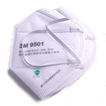
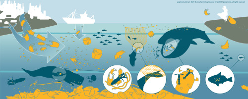
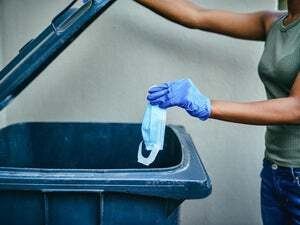

```{r, include=FALSE}
library(flexdashboard)
knitr::opts_chunk$set(echo = FALSE,
                      cache = TRUE,
                      warning = FALSE,
                      tidy = FALSE,
                      message = FALSE,
                      fig.align = 'center',
                      out.width = "80%")
options(knitr.table.format = "html") 
```

```{r, include=FALSE}
knitr::write_bib(c('posterdown', 'rmarkdown','pagedown'), 'packages.bib')
library(flexdashboard); library(tidyverse); library(fontawesome); library(ggpubr); library(ggimage); library(magick);library(ggtext)
#source("../code/infographic.R")
source("../covid_litter_uk.R")
data <- read_rds("../output/mask_pollution.rds")
data_1 <- read_rds("../data/covid_poll.rds")

```


```{r}
uk <- data %>%
  filter(Countries == "United Kingdom")  %>%
  mutate(values = parse_number(values)) %>%
  .[c(9, 13:14),]
  

label = "Daily mask usage 46.5 Mt\nSurgical mask waste 61 kt\nFFP waste 37 kt"
  

```


<p style="font-family: helvetica; font-size:20pt; font-weight:bold; color:goldenrod">Face masks have helped reduce the spread of COVID but...</p>   

<p style="font-family: 'fantasy', 'copperplate'; font-size:16pt; font-weight:bold; color:white">Billions of face masks have been discarded</p>


```{r, eval=FALSE}
valueBox(dfm, caption = "Daily use")
```


```{r fig.height=3.5}

w1 <- data_1 %>%
  mutate(fm = parse_number(`Estimated daily facemask discarded`),
    face_mask_discarded_Mt = fm/ 10^6, 
    uk = ifelse(Country == "United Kingdom", "uk", "n")) %>%
  ggplot() +
  geom_col(aes(reorder(Country, face_mask_discarded_Mt), face_mask_discarded_Mt, fill = uk), show.legend = FALSE) + 
  scale_y_continuous(label = scales::comma) +
  scale_fill_manual(values = c("red", "black")) +
  labs(y = "Masks discarded (millions)", 
       x = "") +
  #theme_minimal() +
  theme(axis.text.x = element_text(colour = "white", size = 10, face = "bold", angle = 45, hjust = 1), 
        axis.text.y = element_text(colour = "white", size = 10, face = "bold"),
        axis.title = element_text(colour = "white", size = 12, face = "bold"), 
        panel.grid = element_blank())

ggbackground(w1,  "../images/i2.jpg") +
  # ggtitle("Billions of face masks have been discarded \ninto the environment since the start of \nthe COVID pandemic") +
  theme(plot.title = element_text(size = 20, face = "bold")) +
  labs(caption = "Source: https://commons.wikimedia.org/wiki/Data:Plastic_waste_percentages_-_Jambeck_et_al"
 )
```

<p style="font-family: 'fantasy', 'copperplate'; font-size:16pt; font-weight:bold; color:white">Face mask pollution in the UK is growing </p>

```{r, fig.height=3.5}

  df <- data.frame(date = as.Date("2020-02-01"),
                 prop = 10, 
                 label = label)

cc <- covid_counts %>%
  mutate(date = lubridate::make_date(year, month, "01"))%>%
  group_by(date) %>%
  summarise(prop = 100 * user[1]/sum(user)) %>%
  ggplot(aes(date, prop)) +
  geom_col(fill = "red") +
  theme_minimal() +
  labs(x = "", 
       y = "COVID-related debris (% of total)") +
  theme(axis.text = element_text(colour = "white", size = 10), 
        axis.title = element_text(colour = "white", size = 14), 
        panel.grid = element_blank(),
        axis.line = element_blank()) +
    annotate("text", x = as.Date("2020-01-01"), y = 13, label = "Pandemic declared", colour = "white", size = 5) +
  geom_textbox(data = df, aes(date, prop, label = label, hjust = 1))

ggbackground(cc,  "../images/i2.jpg") +
  #ggtitle("COVID-related pollution is growing") +
  theme(plot.title = element_text(size = 30, face = "bold")) +
  labs(caption = "Analysis of https://www.nature.com/articles/s41893-021-00824-1") 

```

<span style="font-family: 'fantasy', 'copperplate'; font-size:18pt; font-weight:bold; color:white">Face masks include</span>


|                      |                      |     
|----------------------:|:---------------------:|:------|
|   <span style="font-family: arial; font-size:16pt; color:yellow">Respirator (FFP)</span> |  {height=50%, width=50%}| <span style="font-family: arial; font-size:16pt; color:blue">Single use plastic</span>
|   <span style="font-family: arial; font-size:16pt; color:yellow">Surgical facemask</span>|  {height=50%, width=50%} | Single use plastic|
<span style="font-family: arial; font-size:16pt; color:yellow">Cloth</span>|{height=50%, width=50%}|Reusable|


 

# Why worry?

Its harming marine life



# What can you do about it?

|<span style="font-family: arial; font-size:20pt; color:yellow">Pick it</span>              |   <span style="font-family: arial; font-size:20pt; color:yellow">Bin it </span>               |    <span style="font-family: arial; font-size:20pt; color:yellow">Make it</span>          |
|:----------------------:|:-----------------------:|:---------------------:|
| |  ||


