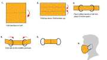

```{r, include=FALSE}
library(flexdashboard)
knitr::opts_chunk$set(echo = FALSE,
                      cache = TRUE,
                      warning = FALSE,
                      tidy = FALSE,
                      message = FALSE,
                      fig.align = 'center',
                      out.width = "80%")
options(knitr.table.format = "html") 
```

```{r, include=FALSE}
knitr::write_bib(c('posterdown', 'rmarkdown','pagedown'), 'packages.bib')
library(flexdashboard); library(tidyverse); library(fontawesome); library(ggpubr); library(ggimage); library(magick)
#source("../code/infographic.R")
source("../covid_litter_uk.R")
data <- read_rds("../output/mask_pollution.rds")
data_1 <- read_rds("../data/covid_poll.rds")

```

<p style="font-family: arial; font-size:20pt; color:yellow">PPE has been essential for preventing teh spread of COVID but it has had unintended consequences...</p>

```{r}
uk <- data %>%
  filter(Countries == "United Kingdom")

dfm <- uk %>%
  filter(metric == "Daily face mask usage") %>%
  pluck("values")


sm_waste <- uk %>%
  filter(metric == "Plastic waste from SM in ton") %>%
  pluck("values")

ff2 <- uk %>%
  filter(metric == "Plastic waste from N95 in ton") %>%
  pluck("values")
```

```{r fig.height=5}

w1 <- data_1 %>%
  mutate(fm = parse_number(`Estimated daily facemask discarded`),
    face_mask_discarded_Mt = fm/ 10^6, 
    uk = ifelse(Country == "United Kingdom", "uk", "n")) %>%
  ggplot() +
  geom_col(aes(reorder(Country, face_mask_discarded_Mt), face_mask_discarded_Mt, fill = uk), show.legend = FALSE) + coord_flip() +
  scale_y_continuous(label = scales::comma) +
  scale_fill_manual(values = c("red", "black")) +
  labs(y = "Masks discarded (millions)", 
       x = "") +
  #theme_minimal() +
  theme(axis.text = element_text(colour = "white", size = 12, face = "bold"), 
        axis.title = element_text(colour = "white", size = 14, face = "bold"))

ggbackground(w1,  "../images/i2.jpg") +
  ggtitle("Billions of face masks have been discarded \ninto the environment since the start of \nthe COVID pandemic") +
  theme(plot.title = element_text(size = 20, face = "bold")) +
  labs(caption = "Source: https://commons.wikimedia.org/wiki/Data:Plastic_waste_percentages_-_Jambeck_et_al"
 )
```

```{r}

cc <- covid_counts %>%
  mutate(date = lubridate::make_date(year, month, "01"))%>%
  group_by(date) %>%
  summarise(prop = 100 * user[1]/sum(user)) %>%
  ggplot(aes(date, prop)) +
  geom_col(fill = "red") +
  theme_minimal() +
  labs(x = "", 
       y = "COVID-related debris (% of total)") +
  theme(axis.text = element_text(colour = "white"), 
        axis.title = element_text(colour = "white")) +
    annotate("text", x = as.Date("2020-01-01"), y = 13, label = "Pandemic declared", colour = "white", size = 5)


ggbackground(cc,  "../images/i2.jpg") +
  ggtitle("COVID-related pollution is growing") +
  theme(plot.title = element_text(size = 20, face = "bold")) +
  labs(caption = "Analysis of https://www.nature.com/articles/s41893-021-00824-1")

```

# What is PPE

<p style="font-family: arial; font-size:20pt; color:yellow">Surgical face-masks and FFP2 masks are single-use plastics</p>

 

# Why worry?

-   t
-   t
-   t
-   
-   
-   

# What can we do about it?

-   t
-   t
-   t

  

# References
