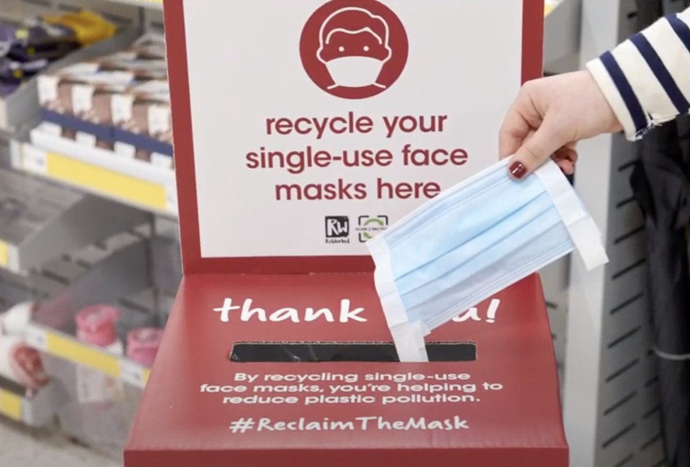

```{r setup, include=FALSE}
library(flexdashboard); library(tidyverse); library(fontawesome); library(ggpubr); library(ggimage); library(magick)
source("../code/infographic.R")
data <- read_rds("mask_pollution.rds")
data_1 <- read_rds("../data/covid_poll.rds")
```


```{r images}
 
i1 <- image_read("https://aqicn.org/images/masks/3m-9501.5.jpg") %>%
  image_write("../images/i1.jpg")
i2 <- image_read("https://unctad.org/sites/default/files/2020-10/2020-27-07_Plastic-pollution_1200x675.jpg")  %>%
  image_write("../images/i2.jpg")
i3 <- image_read("https://hips.hearstapps.com/hmg-prod.s3.amazonaws.com/images/three-different-protection-face-masks-coronavirus-royalty-free-image-1627509000.jpg")  %>%
  image_write("../images/i3.jpg")
i4 <- image_read("https://static.independent.co.uk/s3fs-public/thumbnails/image/2020/07/10/17/istock-1225880373.jpg?width=300")  %>%
  image_write("../images/i4.jpg")
i5 <- image_read("https://media.istockphoto.com/vectors/disposing-of-ppe-face-mask-safely-vector-id1249867483?k=20&m=1249867483&s=170667a&w=0&h=gPhXUVXRJuMn_deaS8vg9PkgiGEFCUb0DD6HsnvVGXo=")  %>%
  image_write("../images/i5.jpg")
i6 <- image_read("https://images.foxtv.com/static.fox13news.com/www.fox13news.com/content/uploads/2020/04/932/524/cdc-bandana-16x9.jpg?width=300")  %>%
  image_write("../images/i6.jpg")

i7 <- image_read("https://pbs.twimg.com/media/ExLo3tcVoA8IPxT?format=jpg&name=medium")  %>%
  image_write("../images/i7.jpg")

```


```{r}
uk <- data %>%
  filter(Countries == "United Kingdom")
```


```{r}

dfm <- uk %>%
  filter(metric == "Daily face mask usage") %>%
  pluck("values")


sm_waste <- uk %>%
  filter(metric == "Plastic waste from SM in ton") %>%
  pluck("values")

ff2 <- uk %>%
  filter(metric == "Plastic waste from N95 in ton") %>%
  pluck("values")


```


```{r fig.height=4}


waste <- data %>%
  arrange(Countries) %>%
  filter(metric == "Total plastic waste generation in ton") %>%
  mutate(values = parse_number(values), 
         uk = ifelse(Countries == "United Kingdom", "uk", "n")) %>%
  ggplot() +
  geom_col(aes(reorder(Countries, values), values, fill = uk), show.legend = FALSE) +
  coord_flip() +
  scale_y_continuous(label = scales::comma) +
  scale_fill_manual(values = c("red", "black")) +
  labs(y = "Plastic waste from masks in tonnes", 
       x = "") +
  theme_minimal() +
  theme(axis.text = element_text(colour = "white", size = 14, face = "bold"), 
        axis.title = element_text(colour = "white", size = 14, face = "bold"))


```


Row
------------------------------------------------------------------------
### Plastic pollution
***
* Plastic pollution
* Plastic pollution
* Single use plastics


***
Some commentary

### Details

Row
-----------------------------------------------------------------------
### Face masks per day disposed of in the UK

```{r, echo=FALSE}
valueBox(dfm, icon = "fa-pencil" )
```

### Which creates surgical mask waste (tons) per year

```{r, echo=FALSE}

valueBox(sm_waste, icon = "fa-mask" )


```

### And N95 waste (tons) per year

```{r,echo=FALSE}
valueBox(ff2, icon = "fa-mask" )

```

### Plastic waste around the world

```{r, echo = FALSE, fig.height=4}

img1 = paste0(here::here() ,"/images/plastic_pollution.jpeg")

now + ggtitle("Global plastic polluters") +
  theme(plot.title = element_text(size = 40, face = "bold"))

ggbackground(now, "../images/plastic_polution_1.jpeg") +
  ggtitle("Global plastic polluters") +
  theme(plot.title = element_text(size = 40, face = "bold"))


```


#Row {data-height=600}
-----------------------------------------------------------------------

### UK face mask rate

```{r, echo=FALSE, fig.height=4}

here::here("images/")

img = paste0(here::here() ,"/images/ppe_poll_2.jpeg")

ggbackground(waste, img)

```

Column
-----------------------------------------------------------

### Solutions

**Less of this...**


**We need more of this...**

 


