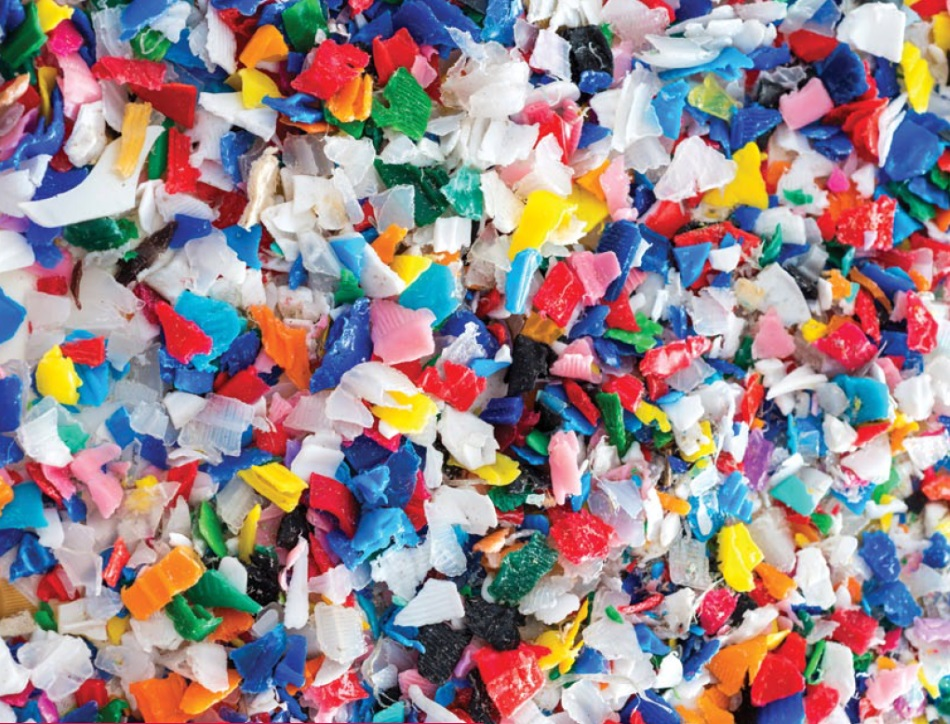

```{r setup, include=FALSE}
knitr::opts_chunk$set(echo = TRUE, message = FALSE, warning = FALSE)

devtools::install_github("julianflowers/myScrapers")
library(tidyverse); library(myScrapers); library(europepmc); library(tidypmc); library(tidytext); library(textrank)
library(quanteda)
library(stm)

```

## Search

Search for `microplastics` and `human health`

```{r, cache = TRUE}

search <- "microplastics health human[mh] review[pt]"
n <- 153
start <- 1990
end <- 2021
key <- Sys.getenv("ncbi_key")

out <- pubmedAbstractR(search = search, n = n, start = start, end = end, ncbi_key = key)


```

```{r review}

out$abstracts %>%
  select(year, title, journal, pmid) %>%
  flextable::flextable(cwidth = 6)

```

### Abstract themes

#### Clustering

```{r}

corpus <- out$abstracts %>%
  rename(absText = abstract) %>%
  create_abstract_corpus() 

corpus <- corpus$corpus %>%
  filter(!word %in% c("human", "health"))
  

cluster <- create_abstract_cluster(corpus, minPts = 4)

cluster$cluster_count

labels <- create_cluster_labels(corpus, clustering = cluster$clustering)

unique(labels$labels)

```

#### Topic modelling

```{r}

corp <- quanteda::corpus(out$abstract$abstract)
dtm <- dfm(corp, remove = c(stopwords("en"), "human", "health"),  remove_punct = TRUE)


stm_c <- convert(dtm, to = "stm")

topics <- stm(documents = stm_c$documents, vocab = stm_c$vocab, data = stm_c$meta, K = 10, init.type = "Spectral")


plot(topics, n = 7, text.cex = .5)


```


### Sample article

`r out$abstracts[out$abstracts$pmid == 33261100, ]$title`

```{r}

details <- europepmc::epmc_details(33261100)
d1 <- europepmc::epmc_details(33264963)

d1$basic

ft_xml <- tidypmc::pmc_xml(details$basic$pmcid)
ft <- tidypmc::pmc_text(ft_xml)
ft_tables <- tidypmc::pmc_table(ft_xml)
ft_refs <- tidypmc::pmc_reference(ft_xml)

summary <- ft |>
  filter(section == "6. Concluding Remarks") %>%
  select(section, text) %>%
  mutate(text = paste(text, collapse = "\\.")) %>%
  distinct() %>%
  mutate(summ = map(text, ~myScrapers::text_summariser(.x, n = 4))) %>%
  unnest("summ")
```

### tl;dr




`r summary$summ`

### References
