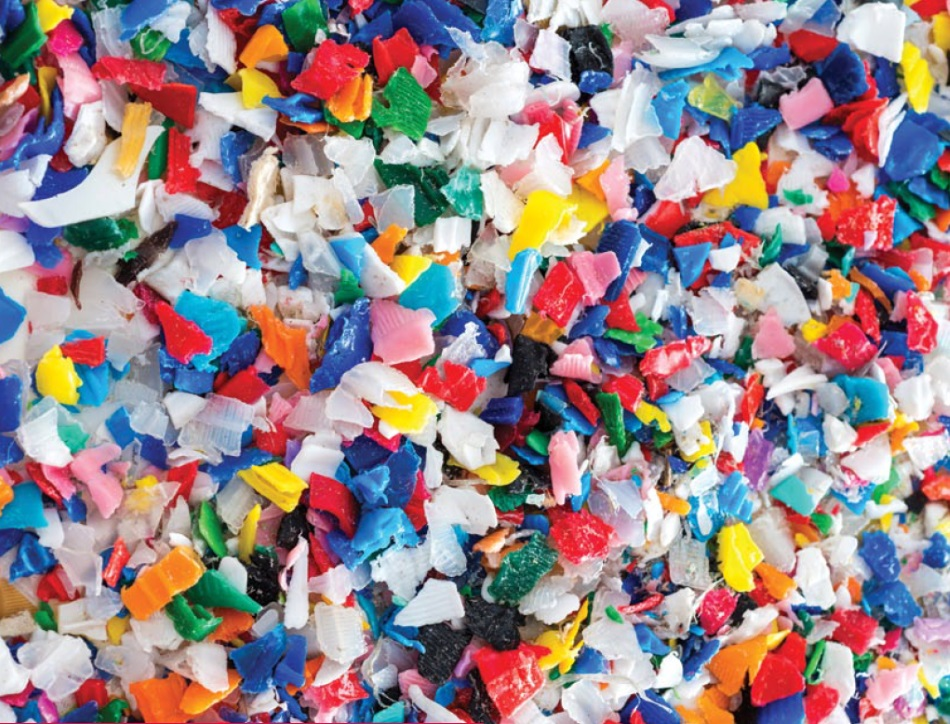

## Search

Search for `microplastics` and `human health`


```r
search <- "microplastics health human[mh] review[pt]"
n <- 153
start <- 1990
end <- 2021
key <- Sys.getenv("ncbi_key")

out <- pubmedAbstractR(search = search, n = n, start = start, end = end, ncbi_key = key)
```

```
## Please wait...Your query is (("microplastics"[MeSH Terms] OR "microplastics"[All Fields]) AND ("health"[MeSH Terms] OR "health"[All Fields]) AND "humans"[MeSH Terms]) AND review[pt] AND 1990[PDAT] : 2021[PDAT]. This returns 153 abstracts. By default 1000 abstracts are downloaded. You downloaded 153 abstracts. To retrieve more set 'n =' argument to the desired value
```


```r
out$abstracts %>%
  select(year, title, journal, pmid) %>%
  flextable::flextable(cwidth = 6)
```

```{=html}
<template id="501c06f6-8de6-47f9-bd04-33012fae3a25"><style>
.tabwid table{
  border-spacing:0px !important;
  border-collapse:collapse;
  line-height:1;
  margin-left:auto;
  margin-right:auto;
  border-width: 0;
  display: table;
  margin-top: 1.275em;
  margin-bottom: 1.275em;
  border-color: transparent;
}
.tabwid_left table{
  margin-left:0;
}
.tabwid_right table{
  margin-right:0;
}
.tabwid td {
    padding: 0;
}
.tabwid a {
  text-decoration: none;
}
.tabwid thead {
    background-color: transparent;
}
.tabwid tfoot {
    background-color: transparent;
}
.tabwid table tr {
background-color: transparent;
}
</style><div class="tabwid"><style>.cl-9b20b8d0{}.cl-9b1ab250{font-family:'Helvetica';font-size:11pt;font-weight:normal;font-style:normal;text-decoration:none;color:rgba(0, 0, 0, 1.00);background-color:transparent;}.cl-9b1abf52{margin:0;text-align:left;border-bottom: 0 solid rgba(0, 0, 0, 1.00);border-top: 0 solid rgba(0, 0, 0, 1.00);border-left: 0 solid rgba(0, 0, 0, 1.00);border-right: 0 solid rgba(0, 0, 0, 1.00);padding-bottom:5pt;padding-top:5pt;padding-left:5pt;padding-right:5pt;line-height: 1;background-color:transparent;}.cl-9b1b3e8c{width:432pt;background-color:transparent;vertical-align: middle;border-bottom: 0 solid rgba(0, 0, 0, 1.00);border-top: 0 solid rgba(0, 0, 0, 1.00);border-left: 0 solid rgba(0, 0, 0, 1.00);border-right: 0 solid rgba(0, 0, 0, 1.00);margin-bottom:0;margin-top:0;margin-left:0;margin-right:0;}.cl-9b1b3e96{width:432pt;background-color:transparent;vertical-align: middle;border-bottom: 2pt solid rgba(102, 102, 102, 1.00);border-top: 0 solid rgba(0, 0, 0, 1.00);border-left: 0 solid rgba(0, 0, 0, 1.00);border-right: 0 solid rgba(0, 0, 0, 1.00);margin-bottom:0;margin-top:0;margin-left:0;margin-right:0;}.cl-9b1b3eaa{width:432pt;background-color:transparent;vertical-align: middle;border-bottom: 2pt solid rgba(102, 102, 102, 1.00);border-top: 2pt solid rgba(102, 102, 102, 1.00);border-left: 0 solid rgba(0, 0, 0, 1.00);border-right: 0 solid rgba(0, 0, 0, 1.00);margin-bottom:0;margin-top:0;margin-left:0;margin-right:0;}</style><table class='cl-9b20b8d0'>
```

```{=html}
<thead><tr style="overflow-wrap:break-word;"><td class="cl-9b1b3eaa"><p class="cl-9b1abf52"><span class="cl-9b1ab250">year</span></p></td><td class="cl-9b1b3eaa"><p class="cl-9b1abf52"><span class="cl-9b1ab250">title</span></p></td><td class="cl-9b1b3eaa"><p class="cl-9b1abf52"><span class="cl-9b1ab250">journal</span></p></td><td class="cl-9b1b3eaa"><p class="cl-9b1abf52"><span class="cl-9b1ab250">pmid</span></p></td></tr></thead><tbody><tr style="overflow-wrap:break-word;"><td class="cl-9b1b3e8c"><p class="cl-9b1abf52"><span class="cl-9b1ab250">2021</span></p></td><td class="cl-9b1b3e8c"><p class="cl-9b1abf52"><span class="cl-9b1ab250">Removal of microplastics from wastewater: available techniques and way forward.</span></p></td><td class="cl-9b1b3e8c"><p class="cl-9b1abf52"><span class="cl-9b1ab250">Water Sci Technol</span></p></td><td class="cl-9b1b3e8c"><p class="cl-9b1abf52"><span class="cl-9b1ab250">34928836</span></p></td></tr><tr style="overflow-wrap:break-word;"><td class="cl-9b1b3e8c"><p class="cl-9b1abf52"><span class="cl-9b1ab250">2021</span></p></td><td class="cl-9b1b3e8c"><p class="cl-9b1abf52"><span class="cl-9b1ab250">Investigating impact of physicochemical properties of microplastics on human health: A short bibliometric analysis and review.</span></p></td><td class="cl-9b1b3e8c"><p class="cl-9b1abf52"><span class="cl-9b1ab250">Chemosphere</span></p></td><td class="cl-9b1b3e8c"><p class="cl-9b1abf52"><span class="cl-9b1ab250">34871607</span></p></td></tr><tr style="overflow-wrap:break-word;"><td class="cl-9b1b3e8c"><p class="cl-9b1abf52"><span class="cl-9b1ab250">2021</span></p></td><td class="cl-9b1b3e8c"><p class="cl-9b1abf52"><span class="cl-9b1ab250">UV-filter pollution: current concerns and future prospects.</span></p></td><td class="cl-9b1b3e8c"><p class="cl-9b1abf52"><span class="cl-9b1ab250">Environ Monit Assess</span></p></td><td class="cl-9b1b3e8c"><p class="cl-9b1abf52"><span class="cl-9b1ab250">34822005</span></p></td></tr><tr style="overflow-wrap:break-word;"><td class="cl-9b1b3e8c"><p class="cl-9b1abf52"><span class="cl-9b1ab250">2021</span></p></td><td class="cl-9b1b3e8c"><p class="cl-9b1abf52"><span class="cl-9b1ab250">Key factors controlling transport of micro- and nanoplastic in porous media and its effect on coexisting pollutants.</span></p></td><td class="cl-9b1b3e8c"><p class="cl-9b1abf52"><span class="cl-9b1ab250">Environ Pollut</span></p></td><td class="cl-9b1b3e8c"><p class="cl-9b1abf52"><span class="cl-9b1ab250">34785290</span></p></td></tr><tr style="overflow-wrap:break-word;"><td class="cl-9b1b3e8c"><p class="cl-9b1abf52"><span class="cl-9b1ab250">2021</span></p></td><td class="cl-9b1b3e8c"><p class="cl-9b1abf52"><span class="cl-9b1ab250">Impact of aquatic microplastics and nanoplastics pollution on ecological systems and sustainable remediation strategies of biodegradation and photodegradation.</span></p></td><td class="cl-9b1b3e8c"><p class="cl-9b1abf52"><span class="cl-9b1ab250">Sci Total Environ</span></p></td><td class="cl-9b1b3e8c"><p class="cl-9b1abf52"><span class="cl-9b1ab250">34736954</span></p></td></tr><tr style="overflow-wrap:break-word;"><td class="cl-9b1b3e8c"><p class="cl-9b1abf52"><span class="cl-9b1ab250">2021</span></p></td><td class="cl-9b1b3e8c"><p class="cl-9b1abf52"><span class="cl-9b1ab250">Microplastics as a vehicle of heavy metals in aquatic environments: A review of adsorption factors, mechanisms, and biological effects.</span></p></td><td class="cl-9b1b3e8c"><p class="cl-9b1abf52"><span class="cl-9b1ab250">J Environ Manage</span></p></td><td class="cl-9b1b3e8c"><p class="cl-9b1abf52"><span class="cl-9b1ab250">34700080</span></p></td></tr><tr style="overflow-wrap:break-word;"><td class="cl-9b1b3e8c"><p class="cl-9b1abf52"><span class="cl-9b1ab250">2021</span></p></td><td class="cl-9b1b3e8c"><p class="cl-9b1abf52"><span class="cl-9b1ab250">A review of environmental metabolism disrupting chemicals and effect biomarkers associating disease risks: Where exposomics meets metabolomics.</span></p></td><td class="cl-9b1b3e8c"><p class="cl-9b1abf52"><span class="cl-9b1ab250">Environ Int</span></p></td><td class="cl-9b1b3e8c"><p class="cl-9b1abf52"><span class="cl-9b1ab250">34689039</span></p></td></tr><tr style="overflow-wrap:break-word;"><td class="cl-9b1b3e8c"><p class="cl-9b1abf52"><span class="cl-9b1ab250">2021</span></p></td><td class="cl-9b1b3e8c"><p class="cl-9b1abf52"><span class="cl-9b1ab250">Dynamics of airborne microplastics, appraisal and distributional behaviour in atmosphere; a review.</span></p></td><td class="cl-9b1b3e8c"><p class="cl-9b1abf52"><span class="cl-9b1ab250">Sci Total Environ</span></p></td><td class="cl-9b1b3e8c"><p class="cl-9b1abf52"><span class="cl-9b1ab250">34656602</span></p></td></tr><tr style="overflow-wrap:break-word;"><td class="cl-9b1b3e8c"><p class="cl-9b1abf52"><span class="cl-9b1ab250">2021</span></p></td><td class="cl-9b1b3e8c"><p class="cl-9b1abf52"><span class="cl-9b1ab250">Tiered testing of micro- and nanoplastics using intestinal in vitro models to support hazard assessments.</span></p></td><td class="cl-9b1b3e8c"><p class="cl-9b1abf52"><span class="cl-9b1ab250">Environ Int</span></p></td><td class="cl-9b1b3e8c"><p class="cl-9b1abf52"><span class="cl-9b1ab250">34634620</span></p></td></tr><tr style="overflow-wrap:break-word;"><td class="cl-9b1b3e8c"><p class="cl-9b1abf52"><span class="cl-9b1ab250">2021</span></p></td><td class="cl-9b1b3e8c"><p class="cl-9b1abf52"><span class="cl-9b1ab250">COVID-19 and antimicrobial resistance: A cross-study.</span></p></td><td class="cl-9b1b3e8c"><p class="cl-9b1abf52"><span class="cl-9b1ab250">Sci Total Environ</span></p></td><td class="cl-9b1b3e8c"><p class="cl-9b1abf52"><span class="cl-9b1ab250">34634340</span></p></td></tr><tr style="overflow-wrap:break-word;"><td class="cl-9b1b3e8c"><p class="cl-9b1abf52"><span class="cl-9b1ab250">2021</span></p></td><td class="cl-9b1b3e8c"><p class="cl-9b1abf52"><span class="cl-9b1ab250">Effects of micro(nano)plastics on higher plants and the rhizosphere environment.</span></p></td><td class="cl-9b1b3e8c"><p class="cl-9b1abf52"><span class="cl-9b1ab250">Sci Total Environ</span></p></td><td class="cl-9b1b3e8c"><p class="cl-9b1abf52"><span class="cl-9b1ab250">34627902</span></p></td></tr><tr style="overflow-wrap:break-word;"><td class="cl-9b1b3e8c"><p class="cl-9b1abf52"><span class="cl-9b1ab250">2021</span></p></td><td class="cl-9b1b3e8c"><p class="cl-9b1abf52"><span class="cl-9b1ab250">Microplastics in the Food Chain: Food Safety and Environmental Aspects.</span></p></td><td class="cl-9b1b3e8c"><p class="cl-9b1abf52"><span class="cl-9b1ab250">Rev Environ Contam Toxicol</span></p></td><td class="cl-9b1b3e8c"><p class="cl-9b1abf52"><span class="cl-9b1ab250">34611754</span></p></td></tr><tr style="overflow-wrap:break-word;"><td class="cl-9b1b3e8c"><p class="cl-9b1abf52"><span class="cl-9b1ab250">2021</span></p></td><td class="cl-9b1b3e8c"><p class="cl-9b1abf52"><span class="cl-9b1ab250">Potential microplastics impacts on African fishing resources.</span></p></td><td class="cl-9b1b3e8c"><p class="cl-9b1abf52"><span class="cl-9b1ab250">Sci Total Environ</span></p></td><td class="cl-9b1b3e8c"><p class="cl-9b1abf52"><span class="cl-9b1ab250">34599958</span></p></td></tr><tr style="overflow-wrap:break-word;"><td class="cl-9b1b3e8c"><p class="cl-9b1abf52"><span class="cl-9b1ab250">2021</span></p></td><td class="cl-9b1b3e8c"><p class="cl-9b1abf52"><span class="cl-9b1ab250">Microplastics: A review of analytical methods, occurrence and characteristics in food, and potential toxicities to biota.</span></p></td><td class="cl-9b1b3e8c"><p class="cl-9b1abf52"><span class="cl-9b1ab250">Sci Total Environ</span></p></td><td class="cl-9b1b3e8c"><p class="cl-9b1abf52"><span class="cl-9b1ab250">34571218</span></p></td></tr><tr style="overflow-wrap:break-word;"><td class="cl-9b1b3e8c"><p class="cl-9b1abf52"><span class="cl-9b1ab250">2021</span></p></td><td class="cl-9b1b3e8c"><p class="cl-9b1abf52"><span class="cl-9b1ab250">Photoluminescence-Based Techniques for the Detection of Micro- and Nanoplastics.</span></p></td><td class="cl-9b1b3e8c"><p class="cl-9b1abf52"><span class="cl-9b1ab250">Chemistry</span></p></td><td class="cl-9b1b3e8c"><p class="cl-9b1abf52"><span class="cl-9b1ab250">34519368</span></p></td></tr><tr style="overflow-wrap:break-word;"><td class="cl-9b1b3e8c"><p class="cl-9b1abf52"><span class="cl-9b1ab250">2021</span></p></td><td class="cl-9b1b3e8c"><p class="cl-9b1abf52"><span class="cl-9b1ab250">Microplastics in aquatic environment: Challenges and perspectives.</span></p></td><td class="cl-9b1b3e8c"><p class="cl-9b1abf52"><span class="cl-9b1ab250">Chemosphere</span></p></td><td class="cl-9b1b3e8c"><p class="cl-9b1abf52"><span class="cl-9b1ab250">34470176</span></p></td></tr><tr style="overflow-wrap:break-word;"><td class="cl-9b1b3e8c"><p class="cl-9b1abf52"><span class="cl-9b1ab250">2021</span></p></td><td class="cl-9b1b3e8c"><p class="cl-9b1abf52"><span class="cl-9b1ab250">Risks of Covid-19 face masks to wildlife: Present and future research needs.</span></p></td><td class="cl-9b1b3e8c"><p class="cl-9b1abf52"><span class="cl-9b1ab250">Sci Total Environ</span></p></td><td class="cl-9b1b3e8c"><p class="cl-9b1abf52"><span class="cl-9b1ab250">34465061</span></p></td></tr><tr style="overflow-wrap:break-word;"><td class="cl-9b1b3e8c"><p class="cl-9b1abf52"><span class="cl-9b1ab250">2021</span></p></td><td class="cl-9b1b3e8c"><p class="cl-9b1abf52"><span class="cl-9b1ab250">Plastic Impacts in Argentina: a Critical Research Review Contributing to the Global Knowledge.</span></p></td><td class="cl-9b1b3e8c"><p class="cl-9b1abf52"><span class="cl-9b1ab250">Curr Environ Health Rep</span></p></td><td class="cl-9b1b3e8c"><p class="cl-9b1abf52"><span class="cl-9b1ab250">34458967</span></p></td></tr><tr style="overflow-wrap:break-word;"><td class="cl-9b1b3e8c"><p class="cl-9b1abf52"><span class="cl-9b1ab250">2021</span></p></td><td class="cl-9b1b3e8c"><p class="cl-9b1abf52"><span class="cl-9b1ab250">Science-society-policy interface for microplastic and nanoplastic: Environmental and biomedical aspects.</span></p></td><td class="cl-9b1b3e8c"><p class="cl-9b1abf52"><span class="cl-9b1ab250">Environ Pollut</span></p></td><td class="cl-9b1b3e8c"><p class="cl-9b1abf52"><span class="cl-9b1ab250">34454195</span></p></td></tr><tr style="overflow-wrap:break-word;"><td class="cl-9b1b3e8c"><p class="cl-9b1abf52"><span class="cl-9b1ab250">2021</span></p></td><td class="cl-9b1b3e8c"><p class="cl-9b1abf52"><span class="cl-9b1ab250">Challenges and opportunities in bioremediation of micro-nano plastics: A review.</span></p></td><td class="cl-9b1b3e8c"><p class="cl-9b1abf52"><span class="cl-9b1ab250">Sci Total Environ</span></p></td><td class="cl-9b1b3e8c"><p class="cl-9b1abf52"><span class="cl-9b1ab250">34454140</span></p></td></tr><tr style="overflow-wrap:break-word;"><td class="cl-9b1b3e8c"><p class="cl-9b1abf52"><span class="cl-9b1ab250">2021</span></p></td><td class="cl-9b1b3e8c"><p class="cl-9b1abf52"><span class="cl-9b1ab250">A critical synthesis of current peer-reviewed literature on the environmental and human health impacts of COVID-19 PPE litter: New findings and next steps.</span></p></td><td class="cl-9b1b3e8c"><p class="cl-9b1abf52"><span class="cl-9b1ab250">J Hazard Mater</span></p></td><td class="cl-9b1b3e8c"><p class="cl-9b1abf52"><span class="cl-9b1ab250">34449351</span></p></td></tr><tr style="overflow-wrap:break-word;"><td class="cl-9b1b3e8c"><p class="cl-9b1abf52"><span class="cl-9b1ab250">2021</span></p></td><td class="cl-9b1b3e8c"><p class="cl-9b1abf52"><span class="cl-9b1ab250">Overview on the occurrence of microplastics in air and implications from the use of face masks during the COVID-19 pandemic.</span></p></td><td class="cl-9b1b3e8c"><p class="cl-9b1abf52"><span class="cl-9b1ab250">Sci Total Environ</span></p></td><td class="cl-9b1b3e8c"><p class="cl-9b1abf52"><span class="cl-9b1ab250">34426330</span></p></td></tr><tr style="overflow-wrap:break-word;"><td class="cl-9b1b3e8c"><p class="cl-9b1abf52"><span class="cl-9b1ab250">2021</span></p></td><td class="cl-9b1b3e8c"><p class="cl-9b1abf52"><span class="cl-9b1ab250">Microplastic pollution in freshwater systems in Southeast Asia: contamination levels, sources, and ecological impacts.</span></p></td><td class="cl-9b1b3e8c"><p class="cl-9b1abf52"><span class="cl-9b1ab250">Environ Sci Pollut Res Int</span></p></td><td class="cl-9b1b3e8c"><p class="cl-9b1abf52"><span class="cl-9b1ab250">34386926</span></p></td></tr><tr style="overflow-wrap:break-word;"><td class="cl-9b1b3e8c"><p class="cl-9b1abf52"><span class="cl-9b1ab250">2021</span></p></td><td class="cl-9b1b3e8c"><p class="cl-9b1abf52"><span class="cl-9b1ab250">On the way to reduce marine microplastics pollution. Research landscape of psychosocial drivers.</span></p></td><td class="cl-9b1b3e8c"><p class="cl-9b1abf52"><span class="cl-9b1ab250">Sci Total Environ</span></p></td><td class="cl-9b1b3e8c"><p class="cl-9b1abf52"><span class="cl-9b1ab250">34358749</span></p></td></tr><tr style="overflow-wrap:break-word;"><td class="cl-9b1b3e8c"><p class="cl-9b1abf52"><span class="cl-9b1ab250">2021</span></p></td><td class="cl-9b1b3e8c"><p class="cl-9b1abf52"><span class="cl-9b1ab250">Biodegradation of microplastics: Better late than never.</span></p></td><td class="cl-9b1b3e8c"><p class="cl-9b1abf52"><span class="cl-9b1ab250">Chemosphere</span></p></td><td class="cl-9b1b3e8c"><p class="cl-9b1abf52"><span class="cl-9b1ab250">34351281</span></p></td></tr><tr style="overflow-wrap:break-word;"><td class="cl-9b1b3e8c"><p class="cl-9b1abf52"><span class="cl-9b1ab250">2021</span></p></td><td class="cl-9b1b3e8c"><p class="cl-9b1abf52"><span class="cl-9b1ab250">Toxicity of nanoplastics for zebrafish embryos, what we know and where to go next.</span></p></td><td class="cl-9b1b3e8c"><p class="cl-9b1abf52"><span class="cl-9b1ab250">Sci Total Environ</span></p></td><td class="cl-9b1b3e8c"><p class="cl-9b1abf52"><span class="cl-9b1ab250">34346375</span></p></td></tr><tr style="overflow-wrap:break-word;"><td class="cl-9b1b3e8c"><p class="cl-9b1abf52"><span class="cl-9b1ab250">2021</span></p></td><td class="cl-9b1b3e8c"><p class="cl-9b1abf52"><span class="cl-9b1ab250">Extraction and detection methods of microplastics in food and marine systems: A critical review.</span></p></td><td class="cl-9b1b3e8c"><p class="cl-9b1abf52"><span class="cl-9b1ab250">Chemosphere</span></p></td><td class="cl-9b1b3e8c"><p class="cl-9b1abf52"><span class="cl-9b1ab250">34346338</span></p></td></tr><tr style="overflow-wrap:break-word;"><td class="cl-9b1b3e8c"><p class="cl-9b1abf52"><span class="cl-9b1ab250">2021</span></p></td><td class="cl-9b1b3e8c"><p class="cl-9b1abf52"><span class="cl-9b1ab250">Influence of Microplastics on the Mobility, Bioavailability, and Toxicity of Heavy Metals: A Review.</span></p></td><td class="cl-9b1b3e8c"><p class="cl-9b1abf52"><span class="cl-9b1ab250">Bull Environ Contam Toxicol</span></p></td><td class="cl-9b1b3e8c"><p class="cl-9b1abf52"><span class="cl-9b1ab250">34331555</span></p></td></tr><tr style="overflow-wrap:break-word;"><td class="cl-9b1b3e8c"><p class="cl-9b1abf52"><span class="cl-9b1ab250">2021</span></p></td><td class="cl-9b1b3e8c"><p class="cl-9b1abf52"><span class="cl-9b1ab250">Environmental occurrence, fate, impact, and potential solution of tire microplastics: Similarities and differences with tire wear particles.</span></p></td><td class="cl-9b1b3e8c"><p class="cl-9b1abf52"><span class="cl-9b1ab250">Sci Total Environ</span></p></td><td class="cl-9b1b3e8c"><p class="cl-9b1abf52"><span class="cl-9b1ab250">34328941</span></p></td></tr><tr style="overflow-wrap:break-word;"><td class="cl-9b1b3e8c"><p class="cl-9b1abf52"><span class="cl-9b1ab250">2021</span></p></td><td class="cl-9b1b3e8c"><p class="cl-9b1abf52"><span class="cl-9b1ab250">Microplastic contaminants in the aqueous environment, fate, toxicity consequences, and remediation strategies.</span></p></td><td class="cl-9b1b3e8c"><p class="cl-9b1abf52"><span class="cl-9b1ab250">Environ Res</span></p></td><td class="cl-9b1b3e8c"><p class="cl-9b1abf52"><span class="cl-9b1ab250">34310963</span></p></td></tr><tr style="overflow-wrap:break-word;"><td class="cl-9b1b3e8c"><p class="cl-9b1abf52"><span class="cl-9b1ab250">2021</span></p></td><td class="cl-9b1b3e8c"><p class="cl-9b1abf52"><span class="cl-9b1ab250">Disparities in Methods Used to Determine Microplastics in the Aquatic Environment: A Review of Legislation, Sampling Process and Instrumental Analysis.</span></p></td><td class="cl-9b1b3e8c"><p class="cl-9b1abf52"><span class="cl-9b1ab250">Int J Environ Res Public Health</span></p></td><td class="cl-9b1b3e8c"><p class="cl-9b1abf52"><span class="cl-9b1ab250">34300059</span></p></td></tr><tr style="overflow-wrap:break-word;"><td class="cl-9b1b3e8c"><p class="cl-9b1abf52"><span class="cl-9b1ab250">2021</span></p></td><td class="cl-9b1b3e8c"><p class="cl-9b1abf52"><span class="cl-9b1ab250">Gastrointestinal tissue as a "new" target of pollution exposure.</span></p></td><td class="cl-9b1b3e8c"><p class="cl-9b1abf52"><span class="cl-9b1ab250">IUBMB Life</span></p></td><td class="cl-9b1b3e8c"><p class="cl-9b1abf52"><span class="cl-9b1ab250">34289226</span></p></td></tr><tr style="overflow-wrap:break-word;"><td class="cl-9b1b3e8c"><p class="cl-9b1abf52"><span class="cl-9b1ab250">2021</span></p></td><td class="cl-9b1b3e8c"><p class="cl-9b1abf52"><span class="cl-9b1ab250">Legislation to limit the environmental plastic and microplastic pollution and their influence on human exposure.</span></p></td><td class="cl-9b1b3e8c"><p class="cl-9b1abf52"><span class="cl-9b1ab250">Environ Pollut</span></p></td><td class="cl-9b1b3e8c"><p class="cl-9b1abf52"><span class="cl-9b1ab250">34256282</span></p></td></tr><tr style="overflow-wrap:break-word;"><td class="cl-9b1b3e8c"><p class="cl-9b1abf52"><span class="cl-9b1ab250">2021</span></p></td><td class="cl-9b1b3e8c"><p class="cl-9b1abf52"><span class="cl-9b1ab250">Microplastics interaction with terrestrial plants and their impacts on agriculture.</span></p></td><td class="cl-9b1b3e8c"><p class="cl-9b1abf52"><span class="cl-9b1ab250">J Environ Qual</span></p></td><td class="cl-9b1b3e8c"><p class="cl-9b1abf52"><span class="cl-9b1ab250">34245023</span></p></td></tr><tr style="overflow-wrap:break-word;"><td class="cl-9b1b3e8c"><p class="cl-9b1abf52"><span class="cl-9b1ab250">2021</span></p></td><td class="cl-9b1b3e8c"><p class="cl-9b1abf52"><span class="cl-9b1ab250">Time to Safeguard the Future Generations from the Omnipresent Microplastics.</span></p></td><td class="cl-9b1b3e8c"><p class="cl-9b1abf52"><span class="cl-9b1ab250">Bull Environ Contam Toxicol</span></p></td><td class="cl-9b1b3e8c"><p class="cl-9b1abf52"><span class="cl-9b1ab250">34223933</span></p></td></tr><tr style="overflow-wrap:break-word;"><td class="cl-9b1b3e8c"><p class="cl-9b1abf52"><span class="cl-9b1ab250">2021</span></p></td><td class="cl-9b1b3e8c"><p class="cl-9b1abf52"><span class="cl-9b1ab250">Evidence from in vitro and in vivo studies on the potential health repercussions of micro- and nanoplastics.</span></p></td><td class="cl-9b1b3e8c"><p class="cl-9b1abf52"><span class="cl-9b1ab250">Chemosphere</span></p></td><td class="cl-9b1b3e8c"><p class="cl-9b1abf52"><span class="cl-9b1ab250">34162123</span></p></td></tr><tr style="overflow-wrap:break-word;"><td class="cl-9b1b3e8c"><p class="cl-9b1abf52"><span class="cl-9b1ab250">2021</span></p></td><td class="cl-9b1b3e8c"><p class="cl-9b1abf52"><span class="cl-9b1ab250">Microplastics contamination in food and beverages: Direct exposure to humans.</span></p></td><td class="cl-9b1b3e8c"><p class="cl-9b1abf52"><span class="cl-9b1ab250">J Food Sci</span></p></td><td class="cl-9b1b3e8c"><p class="cl-9b1abf52"><span class="cl-9b1ab250">34146409</span></p></td></tr><tr style="overflow-wrap:break-word;"><td class="cl-9b1b3e8c"><p class="cl-9b1abf52"><span class="cl-9b1ab250">2021</span></p></td><td class="cl-9b1b3e8c"><p class="cl-9b1abf52"><span class="cl-9b1ab250">Microplastics as an emerging source of particulate air pollution: A critical review.</span></p></td><td class="cl-9b1b3e8c"><p class="cl-9b1abf52"><span class="cl-9b1ab250">J Hazard Mater</span></p></td><td class="cl-9b1b3e8c"><p class="cl-9b1abf52"><span class="cl-9b1ab250">34111744</span></p></td></tr><tr style="overflow-wrap:break-word;"><td class="cl-9b1b3e8c"><p class="cl-9b1abf52"><span class="cl-9b1ab250">2021</span></p></td><td class="cl-9b1b3e8c"><p class="cl-9b1abf52"><span class="cl-9b1ab250">Microplastic pollution in aquatic environments with special emphasis on riverine systems: Current understanding and way forward.</span></p></td><td class="cl-9b1b3e8c"><p class="cl-9b1abf52"><span class="cl-9b1ab250">J Environ Manage</span></p></td><td class="cl-9b1b3e8c"><p class="cl-9b1abf52"><span class="cl-9b1ab250">34089959</span></p></td></tr><tr style="overflow-wrap:break-word;"><td class="cl-9b1b3e8c"><p class="cl-9b1abf52"><span class="cl-9b1ab250">2021</span></p></td><td class="cl-9b1b3e8c"><p class="cl-9b1abf52"><span class="cl-9b1ab250">Wastewater-Based Epidemiology as an Early Warning System for the Spreading of SARS-CoV-2 and Its Mutations in the Population.</span></p></td><td class="cl-9b1b3e8c"><p class="cl-9b1abf52"><span class="cl-9b1ab250">Int J Environ Res Public Health</span></p></td><td class="cl-9b1b3e8c"><p class="cl-9b1abf52"><span class="cl-9b1ab250">34070320</span></p></td></tr><tr style="overflow-wrap:break-word;"><td class="cl-9b1b3e8c"><p class="cl-9b1abf52"><span class="cl-9b1ab250">2021</span></p></td><td class="cl-9b1b3e8c"><p class="cl-9b1abf52"><span class="cl-9b1ab250">Micro (nano) plastic pollution: The ecological influence on soil-plant system and human health.</span></p></td><td class="cl-9b1b3e8c"><p class="cl-9b1abf52"><span class="cl-9b1ab250">Sci Total Environ</span></p></td><td class="cl-9b1b3e8c"><p class="cl-9b1abf52"><span class="cl-9b1ab250">34034191</span></p></td></tr><tr style="overflow-wrap:break-word;"><td class="cl-9b1b3e8c"><p class="cl-9b1abf52"><span class="cl-9b1ab250">2021</span></p></td><td class="cl-9b1b3e8c"><p class="cl-9b1abf52"><span class="cl-9b1ab250">Resolving the effects of environmental micro- and nanoplastics exposure in biota: A knowledge gap analysis.</span></p></td><td class="cl-9b1b3e8c"><p class="cl-9b1abf52"><span class="cl-9b1ab250">Sci Total Environ</span></p></td><td class="cl-9b1b3e8c"><p class="cl-9b1abf52"><span class="cl-9b1ab250">34030291</span></p></td></tr><tr style="overflow-wrap:break-word;"><td class="cl-9b1b3e8c"><p class="cl-9b1abf52"><span class="cl-9b1ab250">2021</span></p></td><td class="cl-9b1b3e8c"><p class="cl-9b1abf52"><span class="cl-9b1ab250">A critical review on the interactions of microplastics with heavy metals: Mechanism and their combined effect on organisms and humans.</span></p></td><td class="cl-9b1b3e8c"><p class="cl-9b1abf52"><span class="cl-9b1ab250">Sci Total Environ</span></p></td><td class="cl-9b1b3e8c"><p class="cl-9b1abf52"><span class="cl-9b1ab250">34029813</span></p></td></tr><tr style="overflow-wrap:break-word;"><td class="cl-9b1b3e8c"><p class="cl-9b1abf52"><span class="cl-9b1ab250">2021</span></p></td><td class="cl-9b1b3e8c"><p class="cl-9b1abf52"><span class="cl-9b1ab250">Survival of human enteric and respiratory viruses on plastics in soil, freshwater, and marine environments.</span></p></td><td class="cl-9b1b3e8c"><p class="cl-9b1abf52"><span class="cl-9b1ab250">Environ Res</span></p></td><td class="cl-9b1b3e8c"><p class="cl-9b1abf52"><span class="cl-9b1ab250">34029551</span></p></td></tr><tr style="overflow-wrap:break-word;"><td class="cl-9b1b3e8c"><p class="cl-9b1abf52"><span class="cl-9b1ab250">2021</span></p></td><td class="cl-9b1b3e8c"><p class="cl-9b1abf52"><span class="cl-9b1ab250">Occurrence and ecological impact of microplastics in aquaculture ecosystems.</span></p></td><td class="cl-9b1b3e8c"><p class="cl-9b1abf52"><span class="cl-9b1ab250">Chemosphere</span></p></td><td class="cl-9b1b3e8c"><p class="cl-9b1abf52"><span class="cl-9b1ab250">33979917</span></p></td></tr><tr style="overflow-wrap:break-word;"><td class="cl-9b1b3e8c"><p class="cl-9b1abf52"><span class="cl-9b1ab250">2021</span></p></td><td class="cl-9b1b3e8c"><p class="cl-9b1abf52"><span class="cl-9b1ab250">The impact of microplastic-microbe interactions on animal health and biogeochemical cycles: A mini-review.</span></p></td><td class="cl-9b1b3e8c"><p class="cl-9b1abf52"><span class="cl-9b1ab250">Sci Total Environ</span></p></td><td class="cl-9b1b3e8c"><p class="cl-9b1abf52"><span class="cl-9b1ab250">33940764</span></p></td></tr><tr style="overflow-wrap:break-word;"><td class="cl-9b1b3e8c"><p class="cl-9b1abf52"><span class="cl-9b1ab250">2021</span></p></td><td class="cl-9b1b3e8c"><p class="cl-9b1abf52"><span class="cl-9b1ab250">Microplastics are a hotspot for antibiotic resistance genes: Progress and perspective.</span></p></td><td class="cl-9b1b3e8c"><p class="cl-9b1abf52"><span class="cl-9b1ab250">Sci Total Environ</span></p></td><td class="cl-9b1b3e8c"><p class="cl-9b1abf52"><span class="cl-9b1ab250">33940744</span></p></td></tr><tr style="overflow-wrap:break-word;"><td class="cl-9b1b3e8c"><p class="cl-9b1abf52"><span class="cl-9b1ab250">2021</span></p></td><td class="cl-9b1b3e8c"><p class="cl-9b1abf52"><span class="cl-9b1ab250">Microplastic: A potential threat to human and animal health by interfering with the intestinal barrier function and changing the intestinal microenvironment.</span></p></td><td class="cl-9b1b3e8c"><p class="cl-9b1abf52"><span class="cl-9b1ab250">Sci Total Environ</span></p></td><td class="cl-9b1b3e8c"><p class="cl-9b1abf52"><span class="cl-9b1ab250">33933760</span></p></td></tr><tr style="overflow-wrap:break-word;"><td class="cl-9b1b3e8c"><p class="cl-9b1abf52"><span class="cl-9b1ab250">2021</span></p></td><td class="cl-9b1b3e8c"><p class="cl-9b1abf52"><span class="cl-9b1ab250">Key mechanisms of micro- and nanoplastic (MNP) toxicity across taxonomic groups.</span></p></td><td class="cl-9b1b3e8c"><p class="cl-9b1abf52"><span class="cl-9b1ab250">Comp Biochem Physiol C Toxicol Pharmacol</span></p></td><td class="cl-9b1b3e8c"><p class="cl-9b1abf52"><span class="cl-9b1ab250">33894368</span></p></td></tr><tr style="overflow-wrap:break-word;"><td class="cl-9b1b3e8c"><p class="cl-9b1abf52"><span class="cl-9b1ab250">2021</span></p></td><td class="cl-9b1b3e8c"><p class="cl-9b1abf52"><span class="cl-9b1ab250">A review of the current environmental status and human health implications of one of the most polluted rivers of Mexico: The Atoyac River, Puebla.</span></p></td><td class="cl-9b1b3e8c"><p class="cl-9b1abf52"><span class="cl-9b1ab250">Sci Total Environ</span></p></td><td class="cl-9b1b3e8c"><p class="cl-9b1abf52"><span class="cl-9b1ab250">33839675</span></p></td></tr><tr style="overflow-wrap:break-word;"><td class="cl-9b1b3e8c"><p class="cl-9b1abf52"><span class="cl-9b1ab250">2021</span></p></td><td class="cl-9b1b3e8c"><p class="cl-9b1abf52"><span class="cl-9b1ab250">Microplastics: A Threat for Male Fertility.</span></p></td><td class="cl-9b1b3e8c"><p class="cl-9b1abf52"><span class="cl-9b1ab250">Int J Environ Res Public Health</span></p></td><td class="cl-9b1b3e8c"><p class="cl-9b1abf52"><span class="cl-9b1ab250">33804513</span></p></td></tr><tr style="overflow-wrap:break-word;"><td class="cl-9b1b3e8c"><p class="cl-9b1abf52"><span class="cl-9b1ab250">2021</span></p></td><td class="cl-9b1b3e8c"><p class="cl-9b1abf52"><span class="cl-9b1ab250">Newly Emerging Airborne Pollutants: Current Knowledge of Health Impact of Micro and Nanoplastics.</span></p></td><td class="cl-9b1b3e8c"><p class="cl-9b1abf52"><span class="cl-9b1ab250">Int J Environ Res Public Health</span></p></td><td class="cl-9b1b3e8c"><p class="cl-9b1abf52"><span class="cl-9b1ab250">33803962</span></p></td></tr><tr style="overflow-wrap:break-word;"><td class="cl-9b1b3e8c"><p class="cl-9b1abf52"><span class="cl-9b1ab250">2021</span></p></td><td class="cl-9b1b3e8c"><p class="cl-9b1abf52"><span class="cl-9b1ab250">How do humans recognize and face challenges of microplastic pollution in marine environments? A bibliometric analysis.</span></p></td><td class="cl-9b1b3e8c"><p class="cl-9b1abf52"><span class="cl-9b1ab250">Environ Pollut</span></p></td><td class="cl-9b1b3e8c"><p class="cl-9b1abf52"><span class="cl-9b1ab250">33780841</span></p></td></tr><tr style="overflow-wrap:break-word;"><td class="cl-9b1b3e8c"><p class="cl-9b1abf52"><span class="cl-9b1ab250">2021</span></p></td><td class="cl-9b1b3e8c"><p class="cl-9b1abf52"><span class="cl-9b1ab250">Insight into the Interaction Between Microplastics and Microorganisms Based on a Bibliometric and Visualized Analysis.</span></p></td><td class="cl-9b1b3e8c"><p class="cl-9b1abf52"><span class="cl-9b1ab250">Bull Environ Contam Toxicol</span></p></td><td class="cl-9b1b3e8c"><p class="cl-9b1abf52"><span class="cl-9b1ab250">33779775</span></p></td></tr><tr style="overflow-wrap:break-word;"><td class="cl-9b1b3e8c"><p class="cl-9b1abf52"><span class="cl-9b1ab250">2021</span></p></td><td class="cl-9b1b3e8c"><p class="cl-9b1abf52"><span class="cl-9b1ab250">Microplastics in aquatic environments: A review on occurrence, distribution, toxic effects, and implications for human health.</span></p></td><td class="cl-9b1b3e8c"><p class="cl-9b1abf52"><span class="cl-9b1ab250">Sci Total Environ</span></p></td><td class="cl-9b1b3e8c"><p class="cl-9b1abf52"><span class="cl-9b1ab250">33773347</span></p></td></tr><tr style="overflow-wrap:break-word;"><td class="cl-9b1b3e8c"><p class="cl-9b1abf52"><span class="cl-9b1ab250">2021</span></p></td><td class="cl-9b1b3e8c"><p class="cl-9b1abf52"><span class="cl-9b1ab250">Microplastics in the human digestive environment: A focus on the potential and challenges facing in vitro gut model development.</span></p></td><td class="cl-9b1b3e8c"><p class="cl-9b1abf52"><span class="cl-9b1ab250">J Hazard Mater</span></p></td><td class="cl-9b1b3e8c"><p class="cl-9b1abf52"><span class="cl-9b1ab250">33770682</span></p></td></tr><tr style="overflow-wrap:break-word;"><td class="cl-9b1b3e8c"><p class="cl-9b1abf52"><span class="cl-9b1ab250">2021</span></p></td><td class="cl-9b1b3e8c"><p class="cl-9b1abf52"><span class="cl-9b1ab250">Are microplastic particles a hotspot for the spread and the persistence of antibiotic resistance in aquatic systems?</span></p></td><td class="cl-9b1b3e8c"><p class="cl-9b1abf52"><span class="cl-9b1ab250">Environ Pollut</span></p></td><td class="cl-9b1b3e8c"><p class="cl-9b1abf52"><span class="cl-9b1ab250">33744628</span></p></td></tr><tr style="overflow-wrap:break-word;"><td class="cl-9b1b3e8c"><p class="cl-9b1abf52"><span class="cl-9b1ab250">2021</span></p></td><td class="cl-9b1b3e8c"><p class="cl-9b1abf52"><span class="cl-9b1ab250">A comprehensive review on assessment of plastic debris in aquatic environment and its prevalence in fishes and other aquatic animals in India.</span></p></td><td class="cl-9b1b3e8c"><p class="cl-9b1abf52"><span class="cl-9b1ab250">Sci Total Environ</span></p></td><td class="cl-9b1b3e8c"><p class="cl-9b1abf52"><span class="cl-9b1ab250">33744569</span></p></td></tr><tr style="overflow-wrap:break-word;"><td class="cl-9b1b3e8c"><p class="cl-9b1abf52"><span class="cl-9b1ab250">2021</span></p></td><td class="cl-9b1b3e8c"><p class="cl-9b1abf52"><span class="cl-9b1ab250">Ecotoxicological and physiological risks of microplastics on fish and their possible mitigation measures.</span></p></td><td class="cl-9b1b3e8c"><p class="cl-9b1abf52"><span class="cl-9b1ab250">Sci Total Environ</span></p></td><td class="cl-9b1b3e8c"><p class="cl-9b1abf52"><span class="cl-9b1ab250">33743469</span></p></td></tr><tr style="overflow-wrap:break-word;"><td class="cl-9b1b3e8c"><p class="cl-9b1abf52"><span class="cl-9b1ab250">2021</span></p></td><td class="cl-9b1b3e8c"><p class="cl-9b1abf52"><span class="cl-9b1ab250">Airborne Microplastics: A Review on the Occurrence, Migration and Risks to Humans.</span></p></td><td class="cl-9b1b3e8c"><p class="cl-9b1abf52"><span class="cl-9b1ab250">Bull Environ Contam Toxicol</span></p></td><td class="cl-9b1b3e8c"><p class="cl-9b1abf52"><span class="cl-9b1ab250">33742221</span></p></td></tr><tr style="overflow-wrap:break-word;"><td class="cl-9b1b3e8c"><p class="cl-9b1abf52"><span class="cl-9b1ab250">2021</span></p></td><td class="cl-9b1b3e8c"><p class="cl-9b1abf52"><span class="cl-9b1ab250">A One Health perspective of the impacts of microplastics on animal, human and environmental health.</span></p></td><td class="cl-9b1b3e8c"><p class="cl-9b1abf52"><span class="cl-9b1ab250">Sci Total Environ</span></p></td><td class="cl-9b1b3e8c"><p class="cl-9b1abf52"><span class="cl-9b1ab250">33677304</span></p></td></tr><tr style="overflow-wrap:break-word;"><td class="cl-9b1b3e8c"><p class="cl-9b1abf52"><span class="cl-9b1ab250">2021</span></p></td><td class="cl-9b1b3e8c"><p class="cl-9b1abf52"><span class="cl-9b1ab250">Microplastics and the functional traits of fishes: A global meta-analysis.</span></p></td><td class="cl-9b1b3e8c"><p class="cl-9b1abf52"><span class="cl-9b1ab250">Glob Chang Biol</span></p></td><td class="cl-9b1b3e8c"><p class="cl-9b1abf52"><span class="cl-9b1ab250">33638211</span></p></td></tr><tr style="overflow-wrap:break-word;"><td class="cl-9b1b3e8c"><p class="cl-9b1abf52"><span class="cl-9b1ab250">2021</span></p></td><td class="cl-9b1b3e8c"><p class="cl-9b1abf52"><span class="cl-9b1ab250">Detection and removal of microplastics in wastewater: evolution and impact.</span></p></td><td class="cl-9b1b3e8c"><p class="cl-9b1abf52"><span class="cl-9b1ab250">Environ Sci Pollut Res Int</span></p></td><td class="cl-9b1b3e8c"><p class="cl-9b1abf52"><span class="cl-9b1ab250">33634402</span></p></td></tr><tr style="overflow-wrap:break-word;"><td class="cl-9b1b3e8c"><p class="cl-9b1abf52"><span class="cl-9b1ab250">2021</span></p></td><td class="cl-9b1b3e8c"><p class="cl-9b1abf52"><span class="cl-9b1ab250">Relevance and reliability of evidence for microplastic contamination in seafood: A critical review using Australian consumption patterns as a case study.</span></p></td><td class="cl-9b1b3e8c"><p class="cl-9b1abf52"><span class="cl-9b1ab250">Environ Pollut</span></p></td><td class="cl-9b1b3e8c"><p class="cl-9b1abf52"><span class="cl-9b1ab250">33618116</span></p></td></tr><tr style="overflow-wrap:break-word;"><td class="cl-9b1b3e8c"><p class="cl-9b1abf52"><span class="cl-9b1ab250">2021</span></p></td><td class="cl-9b1b3e8c"><p class="cl-9b1abf52"><span class="cl-9b1ab250">A review of human and animals exposure to polycyclic aromatic hydrocarbons: Health risk and adverse effects, photo-induced toxicity and regulating effect of microplastics.</span></p></td><td class="cl-9b1b3e8c"><p class="cl-9b1abf52"><span class="cl-9b1ab250">Sci Total Environ</span></p></td><td class="cl-9b1b3e8c"><p class="cl-9b1abf52"><span class="cl-9b1ab250">33582342</span></p></td></tr><tr style="overflow-wrap:break-word;"><td class="cl-9b1b3e8c"><p class="cl-9b1abf52"><span class="cl-9b1ab250">2021</span></p></td><td class="cl-9b1b3e8c"><p class="cl-9b1abf52"><span class="cl-9b1ab250">Understanding plastic degradation and microplastic formation in the environment: A review.</span></p></td><td class="cl-9b1b3e8c"><p class="cl-9b1abf52"><span class="cl-9b1ab250">Environ Pollut</span></p></td><td class="cl-9b1b3e8c"><p class="cl-9b1abf52"><span class="cl-9b1ab250">33529891</span></p></td></tr><tr style="overflow-wrap:break-word;"><td class="cl-9b1b3e8c"><p class="cl-9b1abf52"><span class="cl-9b1ab250">2021</span></p></td><td class="cl-9b1b3e8c"><p class="cl-9b1abf52"><span class="cl-9b1ab250">Interactions between microplastics, pharmaceuticals and personal care products: Implications for vector transport.</span></p></td><td class="cl-9b1b3e8c"><p class="cl-9b1abf52"><span class="cl-9b1ab250">Environ Int</span></p></td><td class="cl-9b1b3e8c"><p class="cl-9b1abf52"><span class="cl-9b1ab250">33497857</span></p></td></tr><tr style="overflow-wrap:break-word;"><td class="cl-9b1b3e8c"><p class="cl-9b1abf52"><span class="cl-9b1ab250">2021</span></p></td><td class="cl-9b1b3e8c"><p class="cl-9b1abf52"><span class="cl-9b1ab250">Environmental factors-mediated behavior of microplastics and nanoplastics in water: A review.</span></p></td><td class="cl-9b1b3e8c"><p class="cl-9b1abf52"><span class="cl-9b1ab250">Chemosphere</span></p></td><td class="cl-9b1b3e8c"><p class="cl-9b1abf52"><span class="cl-9b1ab250">33460897</span></p></td></tr><tr style="overflow-wrap:break-word;"><td class="cl-9b1b3e8c"><p class="cl-9b1abf52"><span class="cl-9b1ab250">2021</span></p></td><td class="cl-9b1b3e8c"><p class="cl-9b1abf52"><span class="cl-9b1ab250">Bibliometrics and visualization analysis regarding research on the development of microplastics.</span></p></td><td class="cl-9b1b3e8c"><p class="cl-9b1abf52"><span class="cl-9b1ab250">Environ Sci Pollut Res Int</span></p></td><td class="cl-9b1b3e8c"><p class="cl-9b1abf52"><span class="cl-9b1ab250">33447976</span></p></td></tr><tr style="overflow-wrap:break-word;"><td class="cl-9b1b3e8c"><p class="cl-9b1abf52"><span class="cl-9b1ab250">2021</span></p></td><td class="cl-9b1b3e8c"><p class="cl-9b1abf52"><span class="cl-9b1ab250">Marine Waste-Sources, Fate, Risks, Challenges and Research Needs.</span></p></td><td class="cl-9b1b3e8c"><p class="cl-9b1abf52"><span class="cl-9b1ab250">Int J Environ Res Public Health</span></p></td><td class="cl-9b1b3e8c"><p class="cl-9b1abf52"><span class="cl-9b1ab250">33430467</span></p></td></tr><tr style="overflow-wrap:break-word;"><td class="cl-9b1b3e8c"><p class="cl-9b1abf52"><span class="cl-9b1ab250">2020</span></p></td><td class="cl-9b1b3e8c"><p class="cl-9b1abf52"><span class="cl-9b1ab250">Microplastics Pollution as an Invisible Potential Threat to Food Safety and Security, Policy Challenges and the Way Forward.</span></p></td><td class="cl-9b1b3e8c"><p class="cl-9b1abf52"><span class="cl-9b1ab250">Int J Environ Res Public Health</span></p></td><td class="cl-9b1b3e8c"><p class="cl-9b1abf52"><span class="cl-9b1ab250">33371479</span></p></td></tr><tr style="overflow-wrap:break-word;"><td class="cl-9b1b3e8c"><p class="cl-9b1abf52"><span class="cl-9b1ab250">2020</span></p></td><td class="cl-9b1b3e8c"><p class="cl-9b1abf52"><span class="cl-9b1ab250">Potential human health risks due to environmental exposure to nano- and microplastics and knowledge gaps: A scoping review.</span></p></td><td class="cl-9b1b3e8c"><p class="cl-9b1abf52"><span class="cl-9b1ab250">Sci Total Environ</span></p></td><td class="cl-9b1b3e8c"><p class="cl-9b1abf52"><span class="cl-9b1ab250">33310568</span></p></td></tr><tr style="overflow-wrap:break-word;"><td class="cl-9b1b3e8c"><p class="cl-9b1abf52"><span class="cl-9b1ab250">2020</span></p></td><td class="cl-9b1b3e8c"><p class="cl-9b1abf52"><span class="cl-9b1ab250">Worldwide actions against plastic pollution from microbeads and microplastics in cosmetics focusing on European policies. Has the issue been handled effectively?</span></p></td><td class="cl-9b1b3e8c"><p class="cl-9b1abf52"><span class="cl-9b1ab250">Mar Pollut Bull</span></p></td><td class="cl-9b1b3e8c"><p class="cl-9b1abf52"><span class="cl-9b1ab250">33310543</span></p></td></tr><tr style="overflow-wrap:break-word;"><td class="cl-9b1b3e8c"><p class="cl-9b1abf52"><span class="cl-9b1ab250">2020</span></p></td><td class="cl-9b1b3e8c"><p class="cl-9b1abf52"><span class="cl-9b1ab250">A review of data for quantifying human exposures to micro and nanoplastics and potential health risks.</span></p></td><td class="cl-9b1b3e8c"><p class="cl-9b1abf52"><span class="cl-9b1ab250">Sci Total Environ</span></p></td><td class="cl-9b1b3e8c"><p class="cl-9b1abf52"><span class="cl-9b1ab250">33310215</span></p></td></tr><tr style="overflow-wrap:break-word;"><td class="cl-9b1b3e8c"><p class="cl-9b1abf52"><span class="cl-9b1ab250">2020</span></p></td><td class="cl-9b1b3e8c"><p class="cl-9b1abf52"><span class="cl-9b1ab250">Interactions of microplastics and antibiotic resistance genes and their effects on the aquaculture environments.</span></p></td><td class="cl-9b1b3e8c"><p class="cl-9b1abf52"><span class="cl-9b1ab250">J Hazard Mater</span></p></td><td class="cl-9b1b3e8c"><p class="cl-9b1abf52"><span class="cl-9b1ab250">33265004</span></p></td></tr><tr style="overflow-wrap:break-word;"><td class="cl-9b1b3e8c"><p class="cl-9b1abf52"><span class="cl-9b1ab250">2020</span></p></td><td class="cl-9b1b3e8c"><p class="cl-9b1abf52"><span class="cl-9b1ab250">Environmental fate, ecotoxicity biomarkers, and potential health effects of micro- and nano-scale plastic contamination.</span></p></td><td class="cl-9b1b3e8c"><p class="cl-9b1abf52"><span class="cl-9b1ab250">J Hazard Mater</span></p></td><td class="cl-9b1b3e8c"><p class="cl-9b1abf52"><span class="cl-9b1ab250">33264963</span></p></td></tr><tr style="overflow-wrap:break-word;"><td class="cl-9b1b3e8c"><p class="cl-9b1abf52"><span class="cl-9b1ab250">2020</span></p></td><td class="cl-9b1b3e8c"><p class="cl-9b1abf52"><span class="cl-9b1ab250">Assessment of Human Health Risks Posed by Nano-and Microplastics Is Currently Not Feasible.</span></p></td><td class="cl-9b1b3e8c"><p class="cl-9b1abf52"><span class="cl-9b1ab250">Int J Environ Res Public Health</span></p></td><td class="cl-9b1b3e8c"><p class="cl-9b1abf52"><span class="cl-9b1ab250">33261100</span></p></td></tr><tr style="overflow-wrap:break-word;"><td class="cl-9b1b3e8c"><p class="cl-9b1abf52"><span class="cl-9b1ab250">2020</span></p></td><td class="cl-9b1b3e8c"><p class="cl-9b1abf52"><span class="cl-9b1ab250">Variation and Uncertainty of Microplastics in Commercial Table Salts: Critical Review and Validation.</span></p></td><td class="cl-9b1b3e8c"><p class="cl-9b1abf52"><span class="cl-9b1ab250">J Hazard Mater</span></p></td><td class="cl-9b1b3e8c"><p class="cl-9b1abf52"><span class="cl-9b1ab250">33254769</span></p></td></tr><tr style="overflow-wrap:break-word;"><td class="cl-9b1b3e8c"><p class="cl-9b1abf52"><span class="cl-9b1ab250">2020</span></p></td><td class="cl-9b1b3e8c"><p class="cl-9b1abf52"><span class="cl-9b1ab250">Environmental prevalence, fate, impacts, and mitigation of microplastics-a critical review on present understanding and future research scope.</span></p></td><td class="cl-9b1b3e8c"><p class="cl-9b1abf52"><span class="cl-9b1ab250">Environ Sci Pollut Res Int</span></p></td><td class="cl-9b1b3e8c"><p class="cl-9b1abf52"><span class="cl-9b1ab250">33241497</span></p></td></tr><tr style="overflow-wrap:break-word;"><td class="cl-9b1b3e8c"><p class="cl-9b1abf52"><span class="cl-9b1ab250">2020</span></p></td><td class="cl-9b1b3e8c"><p class="cl-9b1abf52"><span class="cl-9b1ab250">Pollutant toxicology with respect to microalgae and cyanobacteria.</span></p></td><td class="cl-9b1b3e8c"><p class="cl-9b1abf52"><span class="cl-9b1ab250">J Environ Sci (China)</span></p></td><td class="cl-9b1b3e8c"><p class="cl-9b1abf52"><span class="cl-9b1ab250">33183695</span></p></td></tr><tr style="overflow-wrap:break-word;"><td class="cl-9b1b3e8c"><p class="cl-9b1abf52"><span class="cl-9b1ab250">2020</span></p></td><td class="cl-9b1b3e8c"><p class="cl-9b1abf52"><span class="cl-9b1ab250">Immunotoxicity and intestinal effects of nano- and microplastics: a review of the literature.</span></p></td><td class="cl-9b1b3e8c"><p class="cl-9b1abf52"><span class="cl-9b1ab250">Part Fibre Toxicol</span></p></td><td class="cl-9b1b3e8c"><p class="cl-9b1abf52"><span class="cl-9b1ab250">33183327</span></p></td></tr><tr style="overflow-wrap:break-word;"><td class="cl-9b1b3e8c"><p class="cl-9b1abf52"><span class="cl-9b1ab250">2020</span></p></td><td class="cl-9b1b3e8c"><p class="cl-9b1abf52"><span class="cl-9b1ab250">Gathering at the top? Environmental controls of microplastic uptake and biomagnification in freshwater food webs.</span></p></td><td class="cl-9b1b3e8c"><p class="cl-9b1abf52"><span class="cl-9b1ab250">Environ Pollut</span></p></td><td class="cl-9b1b3e8c"><p class="cl-9b1abf52"><span class="cl-9b1ab250">33172701</span></p></td></tr><tr style="overflow-wrap:break-word;"><td class="cl-9b1b3e8c"><p class="cl-9b1abf52"><span class="cl-9b1ab250">2020</span></p></td><td class="cl-9b1b3e8c"><p class="cl-9b1abf52"><span class="cl-9b1ab250">Microplastics in the coral reefs and their potential impacts on corals: A mini-review.</span></p></td><td class="cl-9b1b3e8c"><p class="cl-9b1abf52"><span class="cl-9b1ab250">Sci Total Environ</span></p></td><td class="cl-9b1b3e8c"><p class="cl-9b1abf52"><span class="cl-9b1ab250">33172634</span></p></td></tr><tr style="overflow-wrap:break-word;"><td class="cl-9b1b3e8c"><p class="cl-9b1abf52"><span class="cl-9b1ab250">2020</span></p></td><td class="cl-9b1b3e8c"><p class="cl-9b1abf52"><span class="cl-9b1ab250">Microplastics and associated contaminants in the aquatic environment: A review on their ecotoxicological effects, trophic transfer, and potential impacts to human health.</span></p></td><td class="cl-9b1b3e8c"><p class="cl-9b1abf52"><span class="cl-9b1ab250">J Hazard Mater</span></p></td><td class="cl-9b1b3e8c"><p class="cl-9b1abf52"><span class="cl-9b1ab250">33153780</span></p></td></tr><tr style="overflow-wrap:break-word;"><td class="cl-9b1b3e8c"><p class="cl-9b1abf52"><span class="cl-9b1ab250">2020</span></p></td><td class="cl-9b1b3e8c"><p class="cl-9b1abf52"><span class="cl-9b1ab250">Biodegradable Plastics: Standards, Policies, and Impacts.</span></p></td><td class="cl-9b1b3e8c"><p class="cl-9b1abf52"><span class="cl-9b1ab250">ChemSusChem</span></p></td><td class="cl-9b1b3e8c"><p class="cl-9b1abf52"><span class="cl-9b1ab250">33112051</span></p></td></tr><tr style="overflow-wrap:break-word;"><td class="cl-9b1b3e8c"><p class="cl-9b1abf52"><span class="cl-9b1ab250">2020</span></p></td><td class="cl-9b1b3e8c"><p class="cl-9b1abf52"><span class="cl-9b1ab250">Toward a unified framework for investigating micro(nano)plastics in packaged beverages intended for human consumption.</span></p></td><td class="cl-9b1b3e8c"><p class="cl-9b1abf52"><span class="cl-9b1ab250">Environ Pollut</span></p></td><td class="cl-9b1b3e8c"><p class="cl-9b1abf52"><span class="cl-9b1ab250">33099200</span></p></td></tr><tr style="overflow-wrap:break-word;"><td class="cl-9b1b3e8c"><p class="cl-9b1abf52"><span class="cl-9b1ab250">2020</span></p></td><td class="cl-9b1b3e8c"><p class="cl-9b1abf52"><span class="cl-9b1ab250">Co-Occurrence of Cyanobacteria and Cyanotoxins with Other Environmental Health Hazards: Impacts and Implications.</span></p></td><td class="cl-9b1b3e8c"><p class="cl-9b1abf52"><span class="cl-9b1ab250">Toxins (Basel)</span></p></td><td class="cl-9b1b3e8c"><p class="cl-9b1abf52"><span class="cl-9b1ab250">33019550</span></p></td></tr><tr style="overflow-wrap:break-word;"><td class="cl-9b1b3e8c"><p class="cl-9b1abf52"><span class="cl-9b1ab250">2020</span></p></td><td class="cl-9b1b3e8c"><p class="cl-9b1abf52"><span class="cl-9b1ab250">Toxicity of airborne particles-established evidence, knowledge gaps and emerging areas of importance.</span></p></td><td class="cl-9b1b3e8c"><p class="cl-9b1abf52"><span class="cl-9b1ab250">Philos Trans A Math Phys Eng Sci</span></p></td><td class="cl-9b1b3e8c"><p class="cl-9b1abf52"><span class="cl-9b1ab250">32981440</span></p></td></tr><tr style="overflow-wrap:break-word;"><td class="cl-9b1b3e8c"><p class="cl-9b1abf52"><span class="cl-9b1ab250">2020</span></p></td><td class="cl-9b1b3e8c"><p class="cl-9b1abf52"><span class="cl-9b1ab250">Microplastics in Food: A Review on Analytical Methods and Challenges.</span></p></td><td class="cl-9b1b3e8c"><p class="cl-9b1abf52"><span class="cl-9b1ab250">Int J Environ Res Public Health</span></p></td><td class="cl-9b1b3e8c"><p class="cl-9b1abf52"><span class="cl-9b1ab250">32942613</span></p></td></tr><tr style="overflow-wrap:break-word;"><td class="cl-9b1b3e8c"><p class="cl-9b1abf52"><span class="cl-9b1ab250">2020</span></p></td><td class="cl-9b1b3e8c"><p class="cl-9b1abf52"><span class="cl-9b1ab250">Effects of microplastics and nanoplastics on marine environment and human health.</span></p></td><td class="cl-9b1b3e8c"><p class="cl-9b1abf52"><span class="cl-9b1ab250">Environ Sci Pollut Res Int</span></p></td><td class="cl-9b1b3e8c"><p class="cl-9b1abf52"><span class="cl-9b1ab250">32876819</span></p></td></tr><tr style="overflow-wrap:break-word;"><td class="cl-9b1b3e8c"><p class="cl-9b1abf52"><span class="cl-9b1ab250">2020</span></p></td><td class="cl-9b1b3e8c"><p class="cl-9b1abf52"><span class="cl-9b1ab250">Review of current trends, advances and analytical challenges for microplastics contamination in Latin America.</span></p></td><td class="cl-9b1b3e8c"><p class="cl-9b1abf52"><span class="cl-9b1ab250">Environ Pollut</span></p></td><td class="cl-9b1b3e8c"><p class="cl-9b1abf52"><span class="cl-9b1ab250">32866877</span></p></td></tr><tr style="overflow-wrap:break-word;"><td class="cl-9b1b3e8c"><p class="cl-9b1abf52"><span class="cl-9b1ab250">2020</span></p></td><td class="cl-9b1b3e8c"><p class="cl-9b1abf52"><span class="cl-9b1ab250">An emerging class of air pollutants: Potential effects of microplastics to respiratory human health?</span></p></td><td class="cl-9b1b3e8c"><p class="cl-9b1abf52"><span class="cl-9b1ab250">Sci Total Environ</span></p></td><td class="cl-9b1b3e8c"><p class="cl-9b1abf52"><span class="cl-9b1ab250">32827829</span></p></td></tr><tr style="overflow-wrap:break-word;"><td class="cl-9b1b3e8c"><p class="cl-9b1abf52"><span class="cl-9b1ab250">2020</span></p></td><td class="cl-9b1b3e8c"><p class="cl-9b1abf52"><span class="cl-9b1ab250">Oceanic Hitchhikers - Assessing Pathogen Risks from Marine Microplastic.</span></p></td><td class="cl-9b1b3e8c"><p class="cl-9b1abf52"><span class="cl-9b1ab250">Trends Microbiol</span></p></td><td class="cl-9b1b3e8c"><p class="cl-9b1abf52"><span class="cl-9b1ab250">32800610</span></p></td></tr><tr style="overflow-wrap:break-word;"><td class="cl-9b1b3e8c"><p class="cl-9b1abf52"><span class="cl-9b1ab250">2020</span></p></td><td class="cl-9b1b3e8c"><p class="cl-9b1abf52"><span class="cl-9b1ab250">Microplastics in waters and soils: Occurrence, analytical methods and ecotoxicological effects.</span></p></td><td class="cl-9b1b3e8c"><p class="cl-9b1abf52"><span class="cl-9b1ab250">Ecotoxicol Environ Saf</span></p></td><td class="cl-9b1b3e8c"><p class="cl-9b1abf52"><span class="cl-9b1ab250">32800245</span></p></td></tr><tr style="overflow-wrap:break-word;"><td class="cl-9b1b3e8c"><p class="cl-9b1abf52"><span class="cl-9b1ab250">2020</span></p></td><td class="cl-9b1b3e8c"><p class="cl-9b1abf52"><span class="cl-9b1ab250">Plastics and microplastics, effects on marine coastal areas: a review.</span></p></td><td class="cl-9b1b3e8c"><p class="cl-9b1abf52"><span class="cl-9b1ab250">Environ Sci Pollut Res Int</span></p></td><td class="cl-9b1b3e8c"><p class="cl-9b1abf52"><span class="cl-9b1ab250">32783179</span></p></td></tr><tr style="overflow-wrap:break-word;"><td class="cl-9b1b3e8c"><p class="cl-9b1abf52"><span class="cl-9b1ab250">2020</span></p></td><td class="cl-9b1b3e8c"><p class="cl-9b1abf52"><span class="cl-9b1ab250">The detrimental effect of microplastics on critical periods of development in the neuroendocrine system.</span></p></td><td class="cl-9b1b3e8c"><p class="cl-9b1abf52"><span class="cl-9b1ab250">Birth Defects Res</span></p></td><td class="cl-9b1b3e8c"><p class="cl-9b1abf52"><span class="cl-9b1ab250">32770630</span></p></td></tr><tr style="overflow-wrap:break-word;"><td class="cl-9b1b3e8c"><p class="cl-9b1abf52"><span class="cl-9b1ab250">2020</span></p></td><td class="cl-9b1b3e8c"><p class="cl-9b1abf52"><span class="cl-9b1ab250">How microplastic components influence the immune system and impact on children health: Focus on cancer.</span></p></td><td class="cl-9b1b3e8c"><p class="cl-9b1abf52"><span class="cl-9b1ab250">Birth Defects Res</span></p></td><td class="cl-9b1b3e8c"><p class="cl-9b1abf52"><span class="cl-9b1ab250">32767490</span></p></td></tr><tr style="overflow-wrap:break-word;"><td class="cl-9b1b3e8c"><p class="cl-9b1abf52"><span class="cl-9b1ab250">2020</span></p></td><td class="cl-9b1b3e8c"><p class="cl-9b1abf52"><span class="cl-9b1ab250">Environmental fate, toxicity and risk management strategies of nanoplastics in the environment: Current status and future perspectives.</span></p></td><td class="cl-9b1b3e8c"><p class="cl-9b1abf52"><span class="cl-9b1ab250">J Hazard Mater</span></p></td><td class="cl-9b1b3e8c"><p class="cl-9b1abf52"><span class="cl-9b1ab250">32763705</span></p></td></tr><tr style="overflow-wrap:break-word;"><td class="cl-9b1b3e8c"><p class="cl-9b1abf52"><span class="cl-9b1ab250">2020</span></p></td><td class="cl-9b1b3e8c"><p class="cl-9b1abf52"><span class="cl-9b1ab250">Environmental distribution, transport and ecotoxicity of microplastics: A review.</span></p></td><td class="cl-9b1b3e8c"><p class="cl-9b1abf52"><span class="cl-9b1ab250">J Appl Toxicol</span></p></td><td class="cl-9b1b3e8c"><p class="cl-9b1abf52"><span class="cl-9b1ab250">32671862</span></p></td></tr><tr style="overflow-wrap:break-word;"><td class="cl-9b1b3e8c"><p class="cl-9b1abf52"><span class="cl-9b1ab250">2020</span></p></td><td class="cl-9b1b3e8c"><p class="cl-9b1abf52"><span class="cl-9b1ab250">Microplastic pollution research methodologies, abundance, characteristics and risk assessments for aquatic biota in China.</span></p></td><td class="cl-9b1b3e8c"><p class="cl-9b1abf52"><span class="cl-9b1ab250">Environ Pollut</span></p></td><td class="cl-9b1b3e8c"><p class="cl-9b1abf52"><span class="cl-9b1ab250">32629309</span></p></td></tr><tr style="overflow-wrap:break-word;"><td class="cl-9b1b3e8c"><p class="cl-9b1abf52"><span class="cl-9b1ab250">2020</span></p></td><td class="cl-9b1b3e8c"><p class="cl-9b1abf52"><span class="cl-9b1ab250">Microplastics as pollutants in agricultural soils.</span></p></td><td class="cl-9b1b3e8c"><p class="cl-9b1abf52"><span class="cl-9b1ab250">Environ Pollut</span></p></td><td class="cl-9b1b3e8c"><p class="cl-9b1abf52"><span class="cl-9b1ab250">32544663</span></p></td></tr><tr style="overflow-wrap:break-word;"><td class="cl-9b1b3e8c"><p class="cl-9b1abf52"><span class="cl-9b1ab250">2020</span></p></td><td class="cl-9b1b3e8c"><p class="cl-9b1abf52"><span class="cl-9b1ab250">Environmental factors in epithelial barrier dysfunction.</span></p></td><td class="cl-9b1b3e8c"><p class="cl-9b1abf52"><span class="cl-9b1ab250">J Allergy Clin Immunol</span></p></td><td class="cl-9b1b3e8c"><p class="cl-9b1abf52"><span class="cl-9b1ab250">32507229</span></p></td></tr><tr style="overflow-wrap:break-word;"><td class="cl-9b1b3e8c"><p class="cl-9b1abf52"><span class="cl-9b1ab250">2020</span></p></td><td class="cl-9b1b3e8c"><p class="cl-9b1abf52"><span class="cl-9b1ab250">Synthetic microfibers: Pollution toxicity and remediation.</span></p></td><td class="cl-9b1b3e8c"><p class="cl-9b1abf52"><span class="cl-9b1ab250">Chemosphere</span></p></td><td class="cl-9b1b3e8c"><p class="cl-9b1abf52"><span class="cl-9b1ab250">32480092</span></p></td></tr><tr style="overflow-wrap:break-word;"><td class="cl-9b1b3e8c"><p class="cl-9b1abf52"><span class="cl-9b1ab250">2020</span></p></td><td class="cl-9b1b3e8c"><p class="cl-9b1abf52"><span class="cl-9b1ab250">Environmental effects of stratospheric ozone depletion, UV radiation and interactions with climate change: UNEP Environmental Effects Assessment Panel, update 2019.</span></p></td><td class="cl-9b1b3e8c"><p class="cl-9b1abf52"><span class="cl-9b1ab250">Photochem Photobiol Sci</span></p></td><td class="cl-9b1b3e8c"><p class="cl-9b1abf52"><span class="cl-9b1ab250">32364555</span></p></td></tr><tr style="overflow-wrap:break-word;"><td class="cl-9b1b3e8c"><p class="cl-9b1abf52"><span class="cl-9b1ab250">2020</span></p></td><td class="cl-9b1b3e8c"><p class="cl-9b1abf52"><span class="cl-9b1ab250">Microplastics and pollutants in biosolids have contaminated agricultural soils: An analytical study and a proposal to cease the use of biosolids in farmlands and utilise them in sustainable bricks.</span></p></td><td class="cl-9b1b3e8c"><p class="cl-9b1abf52"><span class="cl-9b1ab250">Waste Manag</span></p></td><td class="cl-9b1b3e8c"><p class="cl-9b1abf52"><span class="cl-9b1ab250">32320938</span></p></td></tr><tr style="overflow-wrap:break-word;"><td class="cl-9b1b3e8c"><p class="cl-9b1abf52"><span class="cl-9b1ab250">2020</span></p></td><td class="cl-9b1b3e8c"><p class="cl-9b1abf52"><span class="cl-9b1ab250">Occurrence of Microplastics in Commercial Seafood under the Perspective of the Human Food Chain. A Review.</span></p></td><td class="cl-9b1b3e8c"><p class="cl-9b1abf52"><span class="cl-9b1ab250">J Agric Food Chem</span></p></td><td class="cl-9b1b3e8c"><p class="cl-9b1abf52"><span class="cl-9b1ab250">32310657</span></p></td></tr><tr style="overflow-wrap:break-word;"><td class="cl-9b1b3e8c"><p class="cl-9b1abf52"><span class="cl-9b1ab250">2020</span></p></td><td class="cl-9b1b3e8c"><p class="cl-9b1abf52"><span class="cl-9b1ab250">[Current situation and health harmful effects of microplastics in the environment].</span></p></td><td class="cl-9b1b3e8c"><p class="cl-9b1abf52"><span class="cl-9b1ab250">Zhonghua Lao Dong Wei Sheng Zhi Ye Bing Za Zhi</span></p></td><td class="cl-9b1b3e8c"><p class="cl-9b1abf52"><span class="cl-9b1ab250">32306685</span></p></td></tr><tr style="overflow-wrap:break-word;"><td class="cl-9b1b3e8c"><p class="cl-9b1abf52"><span class="cl-9b1ab250">2020</span></p></td><td class="cl-9b1b3e8c"><p class="cl-9b1abf52"><span class="cl-9b1ab250">Cell organelles as targets of mammalian cadmium toxicity.</span></p></td><td class="cl-9b1b3e8c"><p class="cl-9b1abf52"><span class="cl-9b1ab250">Arch Toxicol</span></p></td><td class="cl-9b1b3e8c"><p class="cl-9b1abf52"><span class="cl-9b1ab250">32206829</span></p></td></tr><tr style="overflow-wrap:break-word;"><td class="cl-9b1b3e8c"><p class="cl-9b1abf52"><span class="cl-9b1ab250">2020</span></p></td><td class="cl-9b1b3e8c"><p class="cl-9b1abf52"><span class="cl-9b1ab250">Characteristics of Plastic Pollution in the Environment: A Review.</span></p></td><td class="cl-9b1b3e8c"><p class="cl-9b1abf52"><span class="cl-9b1ab250">Bull Environ Contam Toxicol</span></p></td><td class="cl-9b1b3e8c"><p class="cl-9b1abf52"><span class="cl-9b1ab250">32166334</span></p></td></tr><tr style="overflow-wrap:break-word;"><td class="cl-9b1b3e8c"><p class="cl-9b1abf52"><span class="cl-9b1ab250">2020</span></p></td><td class="cl-9b1b3e8c"><p class="cl-9b1abf52"><span class="cl-9b1ab250">Potent Impact of Plastic Nanomaterials and Micromaterials on the Food Chain and Human Health.</span></p></td><td class="cl-9b1b3e8c"><p class="cl-9b1abf52"><span class="cl-9b1ab250">Int J Mol Sci</span></p></td><td class="cl-9b1b3e8c"><p class="cl-9b1abf52"><span class="cl-9b1ab250">32138322</span></p></td></tr><tr style="overflow-wrap:break-word;"><td class="cl-9b1b3e8c"><p class="cl-9b1abf52"><span class="cl-9b1ab250">2020</span></p></td><td class="cl-9b1b3e8c"><p class="cl-9b1abf52"><span class="cl-9b1ab250">A Review of Microplastics in Table Salt, Drinking Water, and Air: Direct Human Exposure.</span></p></td><td class="cl-9b1b3e8c"><p class="cl-9b1abf52"><span class="cl-9b1ab250">Environ Sci Technol</span></p></td><td class="cl-9b1b3e8c"><p class="cl-9b1abf52"><span class="cl-9b1ab250">32119774</span></p></td></tr><tr style="overflow-wrap:break-word;"><td class="cl-9b1b3e8c"><p class="cl-9b1abf52"><span class="cl-9b1ab250">2020</span></p></td><td class="cl-9b1b3e8c"><p class="cl-9b1abf52"><span class="cl-9b1ab250">Toxicity of Microplastics and Nanoplastics in Mammalian Systems.</span></p></td><td class="cl-9b1b3e8c"><p class="cl-9b1abf52"><span class="cl-9b1ab250">Int J Environ Res Public Health</span></p></td><td class="cl-9b1b3e8c"><p class="cl-9b1abf52"><span class="cl-9b1ab250">32111046</span></p></td></tr><tr style="overflow-wrap:break-word;"><td class="cl-9b1b3e8c"><p class="cl-9b1abf52"><span class="cl-9b1ab250">2020</span></p></td><td class="cl-9b1b3e8c"><p class="cl-9b1abf52"><span class="cl-9b1ab250">A review of microplastics in the aquatic environmental: distribution, transport, ecotoxicology, and toxicological mechanisms.</span></p></td><td class="cl-9b1b3e8c"><p class="cl-9b1abf52"><span class="cl-9b1ab250">Environ Sci Pollut Res Int</span></p></td><td class="cl-9b1b3e8c"><p class="cl-9b1abf52"><span class="cl-9b1ab250">32088821</span></p></td></tr><tr style="overflow-wrap:break-word;"><td class="cl-9b1b3e8c"><p class="cl-9b1abf52"><span class="cl-9b1ab250">2020</span></p></td><td class="cl-9b1b3e8c"><p class="cl-9b1abf52"><span class="cl-9b1ab250">Source, migration and toxicology of microplastics in soil.</span></p></td><td class="cl-9b1b3e8c"><p class="cl-9b1abf52"><span class="cl-9b1ab250">Environ Int</span></p></td><td class="cl-9b1b3e8c"><p class="cl-9b1abf52"><span class="cl-9b1ab250">32087481</span></p></td></tr><tr style="overflow-wrap:break-word;"><td class="cl-9b1b3e8c"><p class="cl-9b1abf52"><span class="cl-9b1ab250">2020</span></p></td><td class="cl-9b1b3e8c"><p class="cl-9b1abf52"><span class="cl-9b1ab250">A Detailed Review Study on Potential Effects of Microplastics and Additives of Concern on Human Health.</span></p></td><td class="cl-9b1b3e8c"><p class="cl-9b1abf52"><span class="cl-9b1ab250">Int J Environ Res Public Health</span></p></td><td class="cl-9b1b3e8c"><p class="cl-9b1abf52"><span class="cl-9b1ab250">32069998</span></p></td></tr><tr style="overflow-wrap:break-word;"><td class="cl-9b1b3e8c"><p class="cl-9b1abf52"><span class="cl-9b1ab250">2019</span></p></td><td class="cl-9b1b3e8c"><p class="cl-9b1abf52"><span class="cl-9b1ab250">Fungal potential for the degradation of petroleum-based polymers: An overview of macro- and microplastics biodegradation.</span></p></td><td class="cl-9b1b3e8c"><p class="cl-9b1abf52"><span class="cl-9b1ab250">Biotechnol Adv</span></p></td><td class="cl-9b1b3e8c"><p class="cl-9b1abf52"><span class="cl-9b1ab250">31870825</span></p></td></tr><tr style="overflow-wrap:break-word;"><td class="cl-9b1b3e8c"><p class="cl-9b1abf52"><span class="cl-9b1ab250">2019</span></p></td><td class="cl-9b1b3e8c"><p class="cl-9b1abf52"><span class="cl-9b1ab250">Potential health impact of environmental micro- and nanoplastics pollution.</span></p></td><td class="cl-9b1b3e8c"><p class="cl-9b1abf52"><span class="cl-9b1ab250">J Appl Toxicol</span></p></td><td class="cl-9b1b3e8c"><p class="cl-9b1abf52"><span class="cl-9b1ab250">31828819</span></p></td></tr><tr style="overflow-wrap:break-word;"><td class="cl-9b1b3e8c"><p class="cl-9b1abf52"><span class="cl-9b1ab250">2019</span></p></td><td class="cl-9b1b3e8c"><p class="cl-9b1abf52"><span class="cl-9b1ab250">Potential adverse health effects of ingested micro- and nanoplastics on humans. Lessons learned from in vivo and in vitro mammalian models.</span></p></td><td class="cl-9b1b3e8c"><p class="cl-9b1abf52"><span class="cl-9b1ab250">J Toxicol Environ Health B Crit Rev</span></p></td><td class="cl-9b1b3e8c"><p class="cl-9b1abf52"><span class="cl-9b1ab250">31822207</span></p></td></tr><tr style="overflow-wrap:break-word;"><td class="cl-9b1b3e8c"><p class="cl-9b1abf52"><span class="cl-9b1ab250">2019</span></p></td><td class="cl-9b1b3e8c"><p class="cl-9b1abf52"><span class="cl-9b1ab250">Microplastics and the gut microbiome: How chronically exposed species may suffer from gut dysbiosis.</span></p></td><td class="cl-9b1b3e8c"><p class="cl-9b1abf52"><span class="cl-9b1ab250">Mar Pollut Bull</span></p></td><td class="cl-9b1b3e8c"><p class="cl-9b1abf52"><span class="cl-9b1ab250">31789155</span></p></td></tr><tr style="overflow-wrap:break-word;"><td class="cl-9b1b3e8c"><p class="cl-9b1abf52"><span class="cl-9b1ab250">2019</span></p></td><td class="cl-9b1b3e8c"><p class="cl-9b1abf52"><span class="cl-9b1ab250">Mini-review of microplastics in the atmosphere and their risks to humans.</span></p></td><td class="cl-9b1b3e8c"><p class="cl-9b1abf52"><span class="cl-9b1ab250">Sci Total Environ</span></p></td><td class="cl-9b1b3e8c"><p class="cl-9b1abf52"><span class="cl-9b1ab250">31753503</span></p></td></tr><tr style="overflow-wrap:break-word;"><td class="cl-9b1b3e8c"><p class="cl-9b1abf52"><span class="cl-9b1ab250">2019</span></p></td><td class="cl-9b1b3e8c"><p class="cl-9b1abf52"><span class="cl-9b1ab250">Bioavailability and toxicity of microplastics to fish species: A review.</span></p></td><td class="cl-9b1b3e8c"><p class="cl-9b1abf52"><span class="cl-9b1ab250">Ecotoxicol Environ Saf</span></p></td><td class="cl-9b1b3e8c"><p class="cl-9b1abf52"><span class="cl-9b1ab250">31735369</span></p></td></tr><tr style="overflow-wrap:break-word;"><td class="cl-9b1b3e8c"><p class="cl-9b1abf52"><span class="cl-9b1ab250">2019</span></p></td><td class="cl-9b1b3e8c"><p class="cl-9b1abf52"><span class="cl-9b1ab250">Environmental exposure to microplastics: An overview on possible human health effects.</span></p></td><td class="cl-9b1b3e8c"><p class="cl-9b1abf52"><span class="cl-9b1ab250">Sci Total Environ</span></p></td><td class="cl-9b1b3e8c"><p class="cl-9b1abf52"><span class="cl-9b1ab250">31733547</span></p></td></tr><tr style="overflow-wrap:break-word;"><td class="cl-9b1b3e8c"><p class="cl-9b1abf52"><span class="cl-9b1ab250">2019</span></p></td><td class="cl-9b1b3e8c"><p class="cl-9b1abf52"><span class="cl-9b1ab250">Plastic microbeads: small yet mighty concerning.</span></p></td><td class="cl-9b1b3e8c"><p class="cl-9b1abf52"><span class="cl-9b1ab250">Int J Environ Health Res</span></p></td><td class="cl-9b1b3e8c"><p class="cl-9b1abf52"><span class="cl-9b1ab250">31709817</span></p></td></tr><tr style="overflow-wrap:break-word;"><td class="cl-9b1b3e8c"><p class="cl-9b1abf52"><span class="cl-9b1ab250">2019</span></p></td><td class="cl-9b1b3e8c"><p class="cl-9b1abf52"><span class="cl-9b1ab250">Airborne microplastics: a review study on method for analysis, occurrence, movement and risks.</span></p></td><td class="cl-9b1b3e8c"><p class="cl-9b1abf52"><span class="cl-9b1ab250">Environ Monit Assess</span></p></td><td class="cl-9b1b3e8c"><p class="cl-9b1abf52"><span class="cl-9b1ab250">31650348</span></p></td></tr><tr style="overflow-wrap:break-word;"><td class="cl-9b1b3e8c"><p class="cl-9b1abf52"><span class="cl-9b1ab250">2019</span></p></td><td class="cl-9b1b3e8c"><p class="cl-9b1abf52"><span class="cl-9b1ab250">Microplastics in ballast water as an emerging source and vector for harmful chemicals, antibiotics, metals, bacterial pathogens and HAB species: A potential risk to the marine environment and human health.</span></p></td><td class="cl-9b1b3e8c"><p class="cl-9b1abf52"><span class="cl-9b1ab250">Mar Pollut Bull</span></p></td><td class="cl-9b1b3e8c"><p class="cl-9b1abf52"><span class="cl-9b1ab250">31470206</span></p></td></tr><tr style="overflow-wrap:break-word;"><td class="cl-9b1b3e8c"><p class="cl-9b1abf52"><span class="cl-9b1ab250">2019</span></p></td><td class="cl-9b1b3e8c"><p class="cl-9b1abf52"><span class="cl-9b1ab250">Microplastics in the environment: A critical review of current understanding and identification of future research needs.</span></p></td><td class="cl-9b1b3e8c"><p class="cl-9b1abf52"><span class="cl-9b1ab250">Environ Pollut</span></p></td><td class="cl-9b1b3e8c"><p class="cl-9b1abf52"><span class="cl-9b1ab250">31404735</span></p></td></tr><tr style="overflow-wrap:break-word;"><td class="cl-9b1b3e8c"><p class="cl-9b1abf52"><span class="cl-9b1ab250">2019</span></p></td><td class="cl-9b1b3e8c"><p class="cl-9b1abf52"><span class="cl-9b1ab250">Solutions and Integrated Strategies for the Control and Mitigation of Plastic and Microplastic Pollution.</span></p></td><td class="cl-9b1b3e8c"><p class="cl-9b1abf52"><span class="cl-9b1ab250">Int J Environ Res Public Health</span></p></td><td class="cl-9b1b3e8c"><p class="cl-9b1abf52"><span class="cl-9b1ab250">31284627</span></p></td></tr><tr style="overflow-wrap:break-word;"><td class="cl-9b1b3e8c"><p class="cl-9b1abf52"><span class="cl-9b1ab250">2019</span></p></td><td class="cl-9b1b3e8c"><p class="cl-9b1abf52"><span class="cl-9b1ab250">Particulate plastics as a vector for toxic trace-element uptake by aquatic and terrestrial organisms and human health risk.</span></p></td><td class="cl-9b1b3e8c"><p class="cl-9b1abf52"><span class="cl-9b1ab250">Environ Int</span></p></td><td class="cl-9b1b3e8c"><p class="cl-9b1abf52"><span class="cl-9b1ab250">31284110</span></p></td></tr><tr style="overflow-wrap:break-word;"><td class="cl-9b1b3e8c"><p class="cl-9b1abf52"><span class="cl-9b1ab250">2019</span></p></td><td class="cl-9b1b3e8c"><p class="cl-9b1abf52"><span class="cl-9b1ab250">Gut microbiota of aquatic organisms: A key endpoint for ecotoxicological studies.</span></p></td><td class="cl-9b1b3e8c"><p class="cl-9b1abf52"><span class="cl-9b1ab250">Environ Pollut</span></p></td><td class="cl-9b1b3e8c"><p class="cl-9b1abf52"><span class="cl-9b1ab250">31091643</span></p></td></tr><tr style="overflow-wrap:break-word;"><td class="cl-9b1b3e8c"><p class="cl-9b1abf52"><span class="cl-9b1ab250">2019</span></p></td><td class="cl-9b1b3e8c"><p class="cl-9b1abf52"><span class="cl-9b1ab250">Marine debris: A review of impacts and global initiatives.</span></p></td><td class="cl-9b1b3e8c"><p class="cl-9b1abf52"><span class="cl-9b1ab250">Waste Manag Res</span></p></td><td class="cl-9b1b3e8c"><p class="cl-9b1abf52"><span class="cl-9b1ab250">31084415</span></p></td></tr><tr style="overflow-wrap:break-word;"><td class="cl-9b1b3e8c"><p class="cl-9b1abf52"><span class="cl-9b1ab250">2019</span></p></td><td class="cl-9b1b3e8c"><p class="cl-9b1abf52"><span class="cl-9b1ab250">Review of micro- and nanoplastic contamination in the food chain.</span></p></td><td class="cl-9b1b3e8c"><p class="cl-9b1abf52"><span class="cl-9b1ab250">Food Addit Contam Part A Chem Anal Control Expo Risk Assess</span></p></td><td class="cl-9b1b3e8c"><p class="cl-9b1abf52"><span class="cl-9b1ab250">30985273</span></p></td></tr><tr style="overflow-wrap:break-word;"><td class="cl-9b1b3e8c"><p class="cl-9b1abf52"><span class="cl-9b1ab250">2019</span></p></td><td class="cl-9b1b3e8c"><p class="cl-9b1abf52"><span class="cl-9b1ab250">Microplastics in coastal areas and seafood: implications for food safety.</span></p></td><td class="cl-9b1b3e8c"><p class="cl-9b1abf52"><span class="cl-9b1ab250">Food Addit Contam Part A Chem Anal Control Expo Risk Assess</span></p></td><td class="cl-9b1b3e8c"><p class="cl-9b1abf52"><span class="cl-9b1ab250">30973067</span></p></td></tr><tr style="overflow-wrap:break-word;"><td class="cl-9b1b3e8c"><p class="cl-9b1abf52"><span class="cl-9b1ab250">2019</span></p></td><td class="cl-9b1b3e8c"><p class="cl-9b1abf52"><span class="cl-9b1ab250">Microplastic exposure and effects in aquatic organisms: A physiological perspective.</span></p></td><td class="cl-9b1b3e8c"><p class="cl-9b1abf52"><span class="cl-9b1ab250">Environ Toxicol Pharmacol</span></p></td><td class="cl-9b1b3e8c"><p class="cl-9b1abf52"><span class="cl-9b1ab250">30870694</span></p></td></tr><tr style="overflow-wrap:break-word;"><td class="cl-9b1b3e8c"><p class="cl-9b1abf52"><span class="cl-9b1ab250">2019</span></p></td><td class="cl-9b1b3e8c"><p class="cl-9b1abf52"><span class="cl-9b1ab250">Microplastics in freshwaters and drinking water: Critical review and assessment of data quality.</span></p></td><td class="cl-9b1b3e8c"><p class="cl-9b1abf52"><span class="cl-9b1ab250">Water Res</span></p></td><td class="cl-9b1b3e8c"><p class="cl-9b1abf52"><span class="cl-9b1ab250">30861380</span></p></td></tr><tr style="overflow-wrap:break-word;"><td class="cl-9b1b3e8c"><p class="cl-9b1abf52"><span class="cl-9b1ab250">2019</span></p></td><td class="cl-9b1b3e8c"><p class="cl-9b1abf52"><span class="cl-9b1ab250">Research and management of plastic pollution in coastal environments of China.</span></p></td><td class="cl-9b1b3e8c"><p class="cl-9b1abf52"><span class="cl-9b1ab250">Environ Pollut</span></p></td><td class="cl-9b1b3e8c"><p class="cl-9b1abf52"><span class="cl-9b1ab250">30856505</span></p></td></tr><tr style="overflow-wrap:break-word;"><td class="cl-9b1b3e8c"><p class="cl-9b1abf52"><span class="cl-9b1ab250">2019</span></p></td><td class="cl-9b1b3e8c"><p class="cl-9b1abf52"><span class="cl-9b1ab250">Interaction between microplastics and microorganism as well as gut microbiota: A consideration on environmental animal and human health.</span></p></td><td class="cl-9b1b3e8c"><p class="cl-9b1abf52"><span class="cl-9b1ab250">Sci Total Environ</span></p></td><td class="cl-9b1b3e8c"><p class="cl-9b1abf52"><span class="cl-9b1ab250">30826685</span></p></td></tr><tr style="overflow-wrap:break-word;"><td class="cl-9b1b3e8c"><p class="cl-9b1abf52"><span class="cl-9b1ab250">2019</span></p></td><td class="cl-9b1b3e8c"><p class="cl-9b1abf52"><span class="cl-9b1ab250">The ecotoxicological effects of microplastics on aquatic food web, from primary producer to human: A review.</span></p></td><td class="cl-9b1b3e8c"><p class="cl-9b1abf52"><span class="cl-9b1ab250">Ecotoxicol Environ Saf</span></p></td><td class="cl-9b1b3e8c"><p class="cl-9b1abf52"><span class="cl-9b1ab250">30771654</span></p></td></tr><tr style="overflow-wrap:break-word;"><td class="cl-9b1b3e8c"><p class="cl-9b1abf52"><span class="cl-9b1ab250">2018</span></p></td><td class="cl-9b1b3e8c"><p class="cl-9b1abf52"><span class="cl-9b1ab250">From the raw bar to the bench: Bivalves as models for human health.</span></p></td><td class="cl-9b1b3e8c"><p class="cl-9b1abf52"><span class="cl-9b1ab250">Dev Comp Immunol</span></p></td><td class="cl-9b1b3e8c"><p class="cl-9b1abf52"><span class="cl-9b1ab250">30503358</span></p></td></tr><tr style="overflow-wrap:break-word;"><td class="cl-9b1b3e8c"><p class="cl-9b1abf52"><span class="cl-9b1ab250">2018</span></p></td><td class="cl-9b1b3e8c"><p class="cl-9b1abf52"><span class="cl-9b1ab250">Occurrence, sources, human health impacts and mitigation of microplastic pollution.</span></p></td><td class="cl-9b1b3e8c"><p class="cl-9b1abf52"><span class="cl-9b1ab250">Environ Sci Pollut Res Int</span></p></td><td class="cl-9b1b3e8c"><p class="cl-9b1abf52"><span class="cl-9b1ab250">30382517</span></p></td></tr><tr style="overflow-wrap:break-word;"><td class="cl-9b1b3e8c"><p class="cl-9b1abf52"><span class="cl-9b1ab250">2018</span></p></td><td class="cl-9b1b3e8c"><p class="cl-9b1abf52"><span class="cl-9b1ab250">Using mussel as a global bioindicator of coastal microplastic pollution.</span></p></td><td class="cl-9b1b3e8c"><p class="cl-9b1abf52"><span class="cl-9b1ab250">Environ Pollut</span></p></td><td class="cl-9b1b3e8c"><p class="cl-9b1abf52"><span class="cl-9b1ab250">30368156</span></p></td></tr><tr style="overflow-wrap:break-word;"><td class="cl-9b1b3e8c"><p class="cl-9b1abf52"><span class="cl-9b1ab250">2018</span></p></td><td class="cl-9b1b3e8c"><p class="cl-9b1abf52"><span class="cl-9b1ab250">Co-selection of multi-antibiotic resistance in bacterial pathogens in metal and microplastic contaminated environments: An emerging health threat.</span></p></td><td class="cl-9b1b3e8c"><p class="cl-9b1abf52"><span class="cl-9b1ab250">Chemosphere</span></p></td><td class="cl-9b1b3e8c"><p class="cl-9b1abf52"><span class="cl-9b1ab250">30359954</span></p></td></tr><tr style="overflow-wrap:break-word;"><td class="cl-9b1b3e8c"><p class="cl-9b1abf52"><span class="cl-9b1ab250">2018</span></p></td><td class="cl-9b1b3e8c"><p class="cl-9b1abf52"><span class="cl-9b1ab250">Microplastics in Seafood and the Implications for Human Health.</span></p></td><td class="cl-9b1b3e8c"><p class="cl-9b1abf52"><span class="cl-9b1ab250">Curr Environ Health Rep</span></p></td><td class="cl-9b1b3e8c"><p class="cl-9b1abf52"><span class="cl-9b1ab250">30116998</span></p></td></tr><tr style="overflow-wrap:break-word;"><td class="cl-9b1b3e8c"><p class="cl-9b1abf52"><span class="cl-9b1ab250">2018</span></p></td><td class="cl-9b1b3e8c"><p class="cl-9b1abf52"><span class="cl-9b1ab250">Plastic contamination of the food chain: A threat to human health?</span></p></td><td class="cl-9b1b3e8c"><p class="cl-9b1abf52"><span class="cl-9b1ab250">Maturitas</span></p></td><td class="cl-9b1b3e8c"><p class="cl-9b1abf52"><span class="cl-9b1ab250">30049349</span></p></td></tr><tr style="overflow-wrap:break-word;"><td class="cl-9b1b3e8c"><p class="cl-9b1abf52"><span class="cl-9b1ab250">2018</span></p></td><td class="cl-9b1b3e8c"><p class="cl-9b1abf52"><span class="cl-9b1ab250">Marine microplastic debris: An emerging issue for food security, food safety and human health.</span></p></td><td class="cl-9b1b3e8c"><p class="cl-9b1abf52"><span class="cl-9b1ab250">Mar Pollut Bull</span></p></td><td class="cl-9b1b3e8c"><p class="cl-9b1abf52"><span class="cl-9b1ab250">30041323</span></p></td></tr><tr style="overflow-wrap:break-word;"><td class="cl-9b1b3e8c"><p class="cl-9b1abf52"><span class="cl-9b1ab250">2018</span></p></td><td class="cl-9b1b3e8c"><p class="cl-9b1abf52"><span class="cl-9b1ab250">Plastic pollution and potential solutions.</span></p></td><td class="cl-9b1b3e8c"><p class="cl-9b1abf52"><span class="cl-9b1ab250">Sci Prog</span></p></td><td class="cl-9b1b3e8c"><p class="cl-9b1abf52"><span class="cl-9b1ab250">30025551</span></p></td></tr><tr style="overflow-wrap:break-word;"><td class="cl-9b1b3e8c"><p class="cl-9b1abf52"><span class="cl-9b1ab250">2018</span></p></td><td class="cl-9b1b3e8c"><p class="cl-9b1abf52"><span class="cl-9b1ab250">Trophic transfer of microplastics and mixed contaminants in the marine food web and implications for human health.</span></p></td><td class="cl-9b1b3e8c"><p class="cl-9b1abf52"><span class="cl-9b1ab250">Environ Int</span></p></td><td class="cl-9b1b3e8c"><p class="cl-9b1abf52"><span class="cl-9b1ab250">29653694</span></p></td></tr><tr style="overflow-wrap:break-word;"><td class="cl-9b1b3e8c"><p class="cl-9b1abf52"><span class="cl-9b1ab250">2018</span></p></td><td class="cl-9b1b3e8c"><p class="cl-9b1abf52"><span class="cl-9b1ab250">Interaction of toxic chemicals with microplastics: A critical review.</span></p></td><td class="cl-9b1b3e8c"><p class="cl-9b1abf52"><span class="cl-9b1ab250">Water Res</span></p></td><td class="cl-9b1b3e8c"><p class="cl-9b1abf52"><span class="cl-9b1ab250">29653356</span></p></td></tr><tr style="overflow-wrap:break-word;"><td class="cl-9b1b3e8c"><p class="cl-9b1abf52"><span class="cl-9b1ab250">2017</span></p></td><td class="cl-9b1b3e8c"><p class="cl-9b1abf52"><span class="cl-9b1ab250">Airborne microplastics: Consequences to human health?</span></p></td><td class="cl-9b1b3e8c"><p class="cl-9b1abf52"><span class="cl-9b1ab250">Environ Pollut</span></p></td><td class="cl-9b1b3e8c"><p class="cl-9b1abf52"><span class="cl-9b1ab250">29172041</span></p></td></tr><tr style="overflow-wrap:break-word;"><td class="cl-9b1b3e8c"><p class="cl-9b1abf52"><span class="cl-9b1ab250">2017</span></p></td><td class="cl-9b1b3e8c"><p class="cl-9b1abf52"><span class="cl-9b1ab250">Wear and Tear of Tyres: A Stealthy Source of Microplastics in the Environment.</span></p></td><td class="cl-9b1b3e8c"><p class="cl-9b1abf52"><span class="cl-9b1ab250">Int J Environ Res Public Health</span></p></td><td class="cl-9b1b3e8c"><p class="cl-9b1abf52"><span class="cl-9b1ab250">29053641</span></p></td></tr><tr style="overflow-wrap:break-word;"><td class="cl-9b1b3e8c"><p class="cl-9b1abf52"><span class="cl-9b1ab250">2017</span></p></td><td class="cl-9b1b3e8c"><p class="cl-9b1abf52"><span class="cl-9b1ab250">Microplastic pollution, a threat to marine ecosystem and human health: a short review.</span></p></td><td class="cl-9b1b3e8c"><p class="cl-9b1abf52"><span class="cl-9b1ab250">Environ Sci Pollut Res Int</span></p></td><td class="cl-9b1b3e8c"><p class="cl-9b1abf52"><span class="cl-9b1ab250">28815367</span></p></td></tr><tr style="overflow-wrap:break-word;"><td class="cl-9b1b3e8c"><p class="cl-9b1abf52"><span class="cl-9b1ab250">2017</span></p></td><td class="cl-9b1b3e8c"><p class="cl-9b1abf52"><span class="cl-9b1ab250">Plastic and Human Health: A Micro Issue?</span></p></td><td class="cl-9b1b3e8c"><p class="cl-9b1abf52"><span class="cl-9b1ab250">Environ Sci Technol</span></p></td><td class="cl-9b1b3e8c"><p class="cl-9b1abf52"><span class="cl-9b1ab250">28531345</span></p></td></tr><tr style="overflow-wrap:break-word;"><td class="cl-9b1b3e8c"><p class="cl-9b1abf52"><span class="cl-9b1ab250">2016</span></p></td><td class="cl-9b1b3e8c"><p class="cl-9b1abf52"><span class="cl-9b1ab250">Microplastics as vectors for bioaccumulation of hydrophobic organic chemicals in the marine environment: A state-of-the-science review.</span></p></td><td class="cl-9b1b3e8c"><p class="cl-9b1abf52"><span class="cl-9b1ab250">Environ Toxicol Chem</span></p></td><td class="cl-9b1b3e8c"><p class="cl-9b1abf52"><span class="cl-9b1ab250">27093569</span></p></td></tr><tr style="overflow-wrap:break-word;"><td class="cl-9b1b3e96"><p class="cl-9b1abf52"><span class="cl-9b1ab250">2015</span></p></td><td class="cl-9b1b3e96"><p class="cl-9b1abf52"><span class="cl-9b1ab250">Potential Health Impact of Environmentally Released Micro- and Nanoplastics in the Human Food Production Chain: Experiences from Nanotoxicology.</span></p></td><td class="cl-9b1b3e96"><p class="cl-9b1abf52"><span class="cl-9b1ab250">Environ Sci Technol</span></p></td><td class="cl-9b1b3e96"><p class="cl-9b1abf52"><span class="cl-9b1ab250">26130306</span></p></td></tr></tbody></table></div></template>
<div class="flextable-shadow-host" id="c82d8495-6ef8-4dd0-a480-9fe0d282a5d0"></div>
<script>
var dest = document.getElementById("c82d8495-6ef8-4dd0-a480-9fe0d282a5d0");
var template = document.getElementById("501c06f6-8de6-47f9-bd04-33012fae3a25");
var caption = template.content.querySelector("caption");
if(caption) {
  caption.style.cssText = "display:block;text-align:center;";
  var newcapt = document.createElement("p");
  newcapt.appendChild(caption)
  dest.parentNode.insertBefore(newcapt, dest.previousSibling);
}
var fantome = dest.attachShadow({mode: 'open'});
var templateContent = template.content;
fantome.appendChild(templateContent);
</script>

```

### Abstract themes

#### Clustering


```r
corpus <- out$abstracts %>%
  rename(absText = abstract) %>%
  create_abstract_corpus() 

corpus <- corpus$corpus %>%
  filter(!word %in% c("human", "health"))
  

cluster <- create_abstract_cluster(corpus, minPts = 4)
```

```
## If there are a small number of abstracts, set perplexity value 
## to less than 30% of abstract count
```

<!-- -->

```
## 0.402 sec elapsed
```

```r
cluster$cluster_count
```

```
## [1] 6
```

```r
labels <- create_cluster_labels(corpus, clustering = cluster$clustering)

unique(labels$labels)
```

```
## # A tibble: 6  2
## # Groups:   cluster [6]
##   cluster clus_names                                                            
##     <dbl> <chr>                                                                 
## 1       0 pollut-environ-effect-studi-microplast-review                         
## 2       1 mnp-micro-challeng-environ-review                                     
## 3       2 gut-microbiota-chemic-exposur-pollut-effect-microplast-review         
## 4       3 np-mp-nanoplast-environment-plastic-effect-review-microplast          
## 5       4 np-mp-nanoplast-degrad-micro-toxic-exposur-effect-studi-plastic-poten
## 6       5 research-environ-potenti-effect-microplast-review
```

#### Topic modelling


```r
corp <- quanteda::corpus(out$abstract$abstract)
dtm <- dfm(corp, remove = c(stopwords("en"), "human", "health"),  remove_punct = TRUE)


stm_c <- convert(dtm, to = "stm")

topics <- stm(documents = stm_c$documents, vocab = stm_c$vocab, data = stm_c$meta, K = 10, init.type = "Spectral")
```

```
## Beginning Spectral Initialization 
## 	 Calculating the gram matrix...
## 	 Finding anchor words...
##  	..........
## 	 Recovering initialization...
##  	......................................
## Initialization complete.
## .........................................................................................................................................................
## Completed E-Step (0 seconds). 
## Completed M-Step. 
## Completing Iteration 1 (approx. per word bound = -6.997) 
## .........................................................................................................................................................
## Completed E-Step (0 seconds). 
## Completed M-Step. 
## Completing Iteration 2 (approx. per word bound = -6.447, relative change = 7.854e-02) 
## .........................................................................................................................................................
## Completed E-Step (0 seconds). 
## Completed M-Step. 
## Completing Iteration 3 (approx. per word bound = -6.405, relative change = 6.512e-03) 
## .........................................................................................................................................................
## Completed E-Step (0 seconds). 
## Completed M-Step. 
## Completing Iteration 4 (approx. per word bound = -6.397, relative change = 1.254e-03) 
## .........................................................................................................................................................
## Completed E-Step (0 seconds). 
## Completed M-Step. 
## Completing Iteration 5 (approx. per word bound = -6.394, relative change = 5.227e-04) 
## Topic 1: mps, nps, aquatic, effects, environment 
##  Topic 2: used, effects, nmps, exposure, aquatic 
##  Topic 3: microplastics, aquatic, review, research, exposure 
##  Topic 4: microplastics, food, exposure, potential, studies 
##  Topic 5: mps, effects, nps, studies, gut 
##  Topic 6: nanoplastics, effects, micro-, toxicity, exposure 
##  Topic 7: plastic, plastics, environment, pollution, waste 
##  Topic 8: mps, environment, environments, microplastic, plastic 
##  Topic 9: microplastics, water, marine, microplastic, waste 
##  Topic 10: marine, microplastics, research, microplastic, plastic 
## .........................................................................................................................................................
## Completed E-Step (0 seconds). 
## Completed M-Step. 
## Completing Iteration 6 (approx. per word bound = -6.391, relative change = 4.273e-04) 
## .........................................................................................................................................................
## Completed E-Step (0 seconds). 
## Completed M-Step. 
## Completing Iteration 7 (approx. per word bound = -6.389, relative change = 2.895e-04) 
## .........................................................................................................................................................
## Completed E-Step (0 seconds). 
## Completed M-Step. 
## Completing Iteration 8 (approx. per word bound = -6.388, relative change = 1.178e-04) 
## .........................................................................................................................................................
## Completed E-Step (0 seconds). 
## Completed M-Step. 
## Completing Iteration 9 (approx. per word bound = -6.388, relative change = 6.753e-05) 
## .........................................................................................................................................................
## Completed E-Step (0 seconds). 
## Completed M-Step. 
## Completing Iteration 10 (approx. per word bound = -6.388, relative change = 5.880e-05) 
## Topic 1: mps, nps, environment, effects, aquatic 
##  Topic 2: used, nmps, effects, exposure, aquatic 
##  Topic 3: microplastics, aquatic, review, research, exposure 
##  Topic 4: microplastics, food, exposure, potential, studies 
##  Topic 5: mps, effects, nps, studies, gut 
##  Topic 6: nanoplastics, effects, micro-, toxicity, exposure 
##  Topic 7: plastic, plastics, environment, pollution, waste 
##  Topic 8: mps, environment, environments, microplastic, plastic 
##  Topic 9: microplastics, water, marine, microplastic, waste 
##  Topic 10: marine, microplastics, research, microplastic, plastic 
## .........................................................................................................................................................
## Completed E-Step (0 seconds). 
## Completed M-Step. 
## Completing Iteration 11 (approx. per word bound = -6.387, relative change = 4.867e-05) 
## .........................................................................................................................................................
## Completed E-Step (0 seconds). 
## Completed M-Step. 
## Completing Iteration 12 (approx. per word bound = -6.387, relative change = 2.584e-05) 
## .........................................................................................................................................................
## Completed E-Step (0 seconds). 
## Completed M-Step. 
## Completing Iteration 13 (approx. per word bound = -6.387, relative change = 1.683e-05) 
## .........................................................................................................................................................
## Completed E-Step (0 seconds). 
## Completed M-Step. 
## Completing Iteration 14 (approx. per word bound = -6.387, relative change = 1.876e-05) 
## .........................................................................................................................................................
## Completed E-Step (0 seconds). 
## Completed M-Step. 
## Completing Iteration 15 (approx. per word bound = -6.387, relative change = 1.590e-05) 
## Topic 1: mps, nps, environment, effects, aquatic 
##  Topic 2: used, nmps, effects, exposure, aquatic 
##  Topic 3: microplastics, aquatic, review, research, exposure 
##  Topic 4: microplastics, food, exposure, potential, studies 
##  Topic 5: mps, effects, nps, studies, gut 
##  Topic 6: nanoplastics, effects, micro-, toxicity, exposure 
##  Topic 7: plastic, plastics, environment, pollution, waste 
##  Topic 8: mps, environment, environments, microplastic, plastic 
##  Topic 9: microplastics, water, marine, microplastic, waste 
##  Topic 10: marine, microplastics, research, microplastic, plastic 
## .........................................................................................................................................................
## Completed E-Step (0 seconds). 
## Completed M-Step. 
## Completing Iteration 16 (approx. per word bound = -6.387, relative change = 2.212e-05) 
## .........................................................................................................................................................
## Completed E-Step (0 seconds). 
## Completed M-Step. 
## Completing Iteration 17 (approx. per word bound = -6.386, relative change = 2.701e-05) 
## .........................................................................................................................................................
## Completed E-Step (0 seconds). 
## Completed M-Step. 
## Completing Iteration 18 (approx. per word bound = -6.386, relative change = 2.481e-05) 
## .........................................................................................................................................................
## Completed E-Step (0 seconds). 
## Completed M-Step. 
## Completing Iteration 19 (approx. per word bound = -6.386, relative change = 1.508e-05) 
## .........................................................................................................................................................
## Completed E-Step (0 seconds). 
## Completed M-Step. 
## Completing Iteration 20 (approx. per word bound = -6.386, relative change = 1.230e-05) 
## Topic 1: mps, nps, environment, effects, aquatic 
##  Topic 2: used, nmps, effects, exposure, aquatic 
##  Topic 3: microplastics, aquatic, review, research, exposure 
##  Topic 4: microplastics, food, exposure, potential, studies 
##  Topic 5: mps, effects, nps, studies, gut 
##  Topic 6: nanoplastics, effects, micro-, toxicity, exposure 
##  Topic 7: plastic, plastics, environment, pollution, waste 
##  Topic 8: mps, environment, environments, microplastic, plastic 
##  Topic 9: microplastics, water, marine, microplastic, waste 
##  Topic 10: marine, microplastics, research, microplastic, plastic 
## .........................................................................................................................................................
## Completed E-Step (0 seconds). 
## Completed M-Step. 
## Completing Iteration 21 (approx. per word bound = -6.386, relative change = 1.505e-05) 
## .........................................................................................................................................................
## Completed E-Step (0 seconds). 
## Completed M-Step. 
## Completing Iteration 22 (approx. per word bound = -6.386, relative change = 2.203e-05) 
## .........................................................................................................................................................
## Completed E-Step (0 seconds). 
## Completed M-Step. 
## Completing Iteration 23 (approx. per word bound = -6.386, relative change = 2.908e-05) 
## .........................................................................................................................................................
## Completed E-Step (0 seconds). 
## Completed M-Step. 
## Completing Iteration 24 (approx. per word bound = -6.385, relative change = 3.142e-05) 
## .........................................................................................................................................................
## Completed E-Step (0 seconds). 
## Completed M-Step. 
## Completing Iteration 25 (approx. per word bound = -6.385, relative change = 2.060e-05) 
## Topic 1: mps, nps, environment, effects, aquatic 
##  Topic 2: used, nmps, effects, exposure, aquatic 
##  Topic 3: microplastics, aquatic, review, research, exposure 
##  Topic 4: microplastics, food, exposure, potential, studies 
##  Topic 5: mps, effects, nps, studies, gut 
##  Topic 6: nanoplastics, effects, micro-, toxicity, exposure 
##  Topic 7: plastic, plastics, environment, pollution, waste 
##  Topic 8: mps, environment, environments, microplastic, plastic 
##  Topic 9: microplastics, water, marine, microplastic, waste 
##  Topic 10: marine, microplastics, research, microplastic, plastic 
## .........................................................................................................................................................
## Completed E-Step (0 seconds). 
## Completed M-Step. 
## Model Converged
```

```r
plot(topics, n = 7, text.cex = .5)
```

<!-- -->


### Sample article

Assessment of Human Health Risks Posed by Nano-and Microplastics Is Currently Not Feasible.


```r
details <- europepmc::epmc_details(33261100)
d1 <- europepmc::epmc_details(33264963)

d1$basic
```

```
## # A tibble: 1  35
##   id       source pmid   doi    title authorString pubYear pageInfo abstractText
##   <chr>    <chr>  <chr>  <chr>  <chr> <chr>        <chr>   <chr>    <chr>       
## 1 33264963 MED    33264 10.10 Envi Rai PK, Lee 2021    123910   In recent d
## #  with 26 more variables: affiliation <chr>, publicationStatus <chr>,
## #   language <chr>, pubModel <chr>, isOpenAccess <chr>, inEPMC <chr>,
## #   inPMC <chr>, hasPDF <chr>, hasBook <chr>, hasSuppl <chr>,
## #   citedByCount <int>, hasData <chr>, hasReferences <chr>,
## #   hasTextMinedTerms <chr>, hasDbCrossReferences <chr>, hasLabsLinks <chr>,
## #   authMan <chr>, epmcAuthMan <chr>, nihAuthMan <chr>,
## #   hasTMAccessionNumbers <chr>, dateOfCompletion <chr>, 
```

```r
ft_xml <- tidypmc::pmc_xml(details$basic$pmcid)
ft <- tidypmc::pmc_text(ft_xml)
ft_tables <- tidypmc::pmc_table(ft_xml)
ft_refs <- tidypmc::pmc_reference(ft_xml)

summary <- ft |>
  filter(section == "6. Concluding Remarks") %>%
  select(section, text) %>%
  mutate(text = paste(text, collapse = "\\.")) %>%
  distinct() %>%
  mutate(summ = map(text, ~myScrapers::text_summariser(.x, n = 4))) %>%
  unnest("summ")
```

### tl;dr




The facts that global plastics production has been growing exponentially since the 1950s, and that nearly the entire human population is nowadays permanently exposed to plastic-derived nmps, warrant a critical view of possible health risks posed by nmps, likely not arising from acute toxicity but maybe from long-term accumulation in the human body, or indirect effects caused by alterations in the gut microbiome. In past years the topic microplastics pollution and possible health risks for humans raised much attention in the public, and led to political discussions to limit or ban the industrial use of plastic microparticles in various products, although scientific data proving or disproving acute or long-term toxicity of nmps are scarce. Effects on human health remain elusive. Owing to the fact that it is extremely difficult to isolate and (chemically) identify micro- and, in particular, nanoparticles from environmental and biological samples, precise numbers about the human exposure towards nmps via the supposedly main uptake routes of ingestion and inhalation have not been determined yet.

### References
